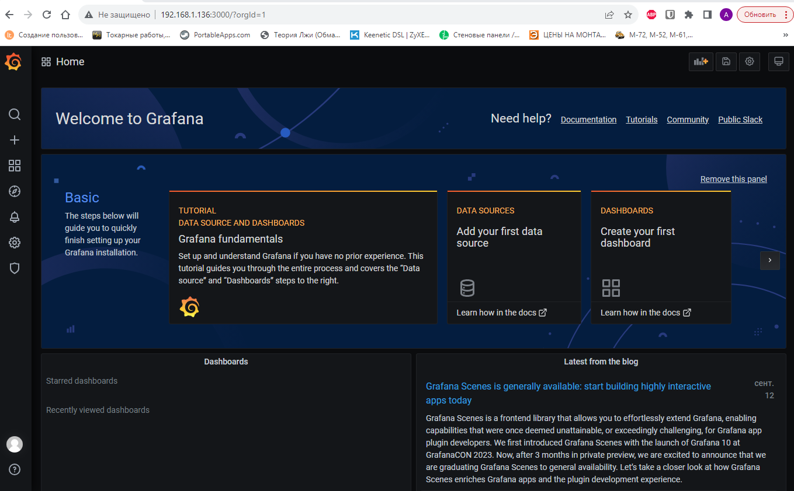
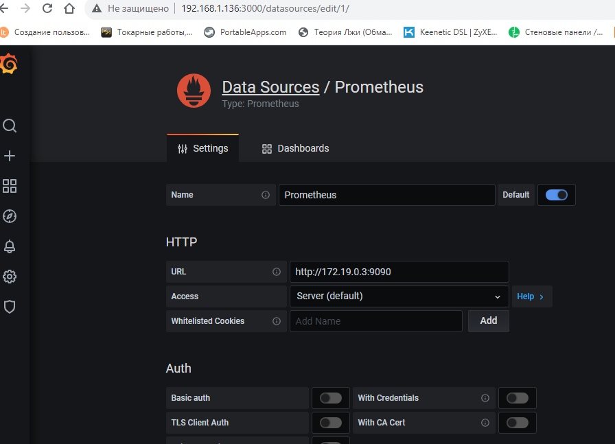
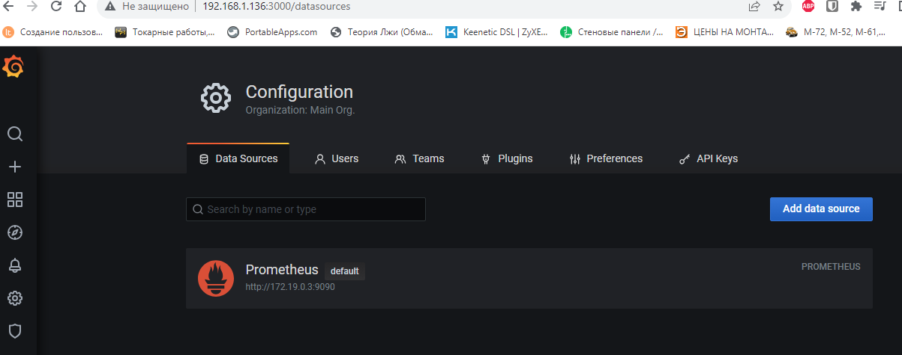
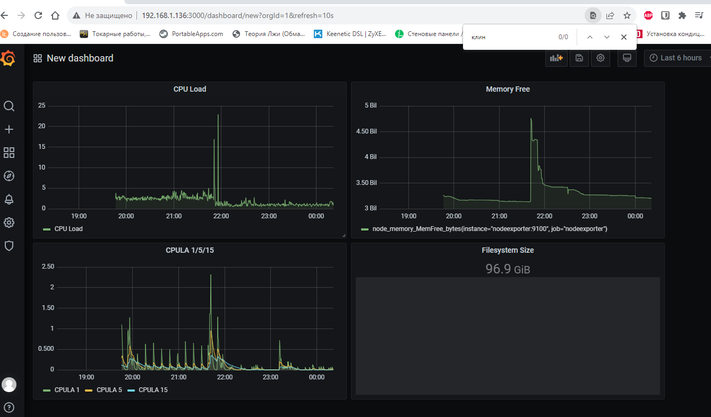
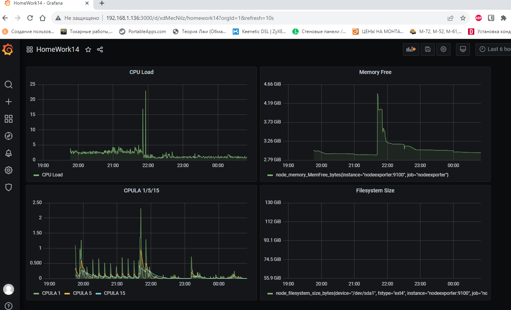

# Домашнее задание к занятию 14 «Средство визуализации Grafana»

## Задание повышенной сложности

**При решении задания 1** не используйте директорию [help](./help) для сборки проекта. Самостоятельно разверните grafana, где в роли источника данных будет выступать prometheus, а сборщиком данных будет node-exporter:

- grafana;
- prometheus-server;
- prometheus node-exporter.

За дополнительными материалами можете обратиться в официальную документацию grafana и prometheus.

В решении к домашнему заданию также приведите все конфигурации, скрипты, манифесты, которые вы 
использовали в процессе решения задания.

**При решении задания 3** вы должны самостоятельно завести удобный для вас канал нотификации, например, Telegram или email, и отправить туда тестовые события.

В решении приведите скриншоты тестовых событий из каналов нотификаций.

## Обязательные задания

### Задание 1

1. Используя директорию [help](./help) внутри этого домашнего задания, запустите связку prometheus-grafana.
    
    *   Используем папку [help](https://github.com/Artegro/netology/tree/master/HomeWork14/help) запускаем контейнеры
    
   
    

1. Зайдите в веб-интерфейс grafana, используя авторизационные данные, указанные в манифесте docker-compose.
    *   Заходим в grafana
    

1. Подключите поднятый вами prometheus, как источник данных.
    *   узнаем ip контейнера с prometheus
        ```
        docker container inspect prometheus
        [
        {
            "Id": "f9cc89d7e0cf876f71db8d60a74fdd02a5c830e19649dc2c420e46f494c4a634",
        ...
                    "IPAddress": "172.19.0.3",
        ...
            }
        ]
        ```
    *   Подключаем источник данных prometheus
        

1. Решение домашнего задания — скриншот веб-интерфейса grafana со списком подключенных Datasource.

    
## Задание 2

Изучите самостоятельно ресурсы:

1. [PromQL tutorial for beginners and humans](https://valyala.medium.com/promql-tutorial-for-beginners-9ab455142085).
1. [Understanding Machine CPU usage](https://www.robustperception.io/understanding-machine-cpu-usage).
1. [Introduction to PromQL, the Prometheus query language](https://grafana.com/blog/2020/02/04/introduction-to-promql-the-prometheus-query-language/).

Создайте Dashboard и в ней создайте Panels:

- утилизация CPU для nodeexporter (в процентах, 100-idle);
- CPULA 1/5/15;
- количество свободной оперативной памяти;
- количество места на файловой системе.

Для решения этого задания приведите promql-запросы для выдачи этих метрик, а также скриншот получившейся Dashboard.

    *   Загурзка процессора в процентах: 
        ```
        100 - avg(irate(node_cpu_seconds_total{mode="idle"}[5m])) without (cpu) * 100
        ```
    *   Средняя загрузка процессора CPULA 1/5/15:
        ```
        node_load1
        node_load5
        node_load15
        ```
    *   количество свободной оперативной памяти:
        ```
        node_memory_MemFree_bytes
        ```
    *   количество места на файловой системе.
        ```
        node_filesystem_size_bytes{device="/dev/sda1"}
        ```


## Задание 3

1. Создайте для каждой Dashboard подходящее правило alert — можно обратиться к первой лекции в блоке «Мониторинг».
1. В качестве решения задания приведите скриншот вашей итоговой Dashboard.

    

## Задание 4

1. Сохраните ваш Dashboard.Для этого перейдите в настройки Dashboard, выберите в боковом меню «JSON MODEL». Далее скопируйте отображаемое json-содержимое в отдельный файл и сохраните его.
1. В качестве решения задания приведите листинг этого файла.
    *   Файл [Dashboard.json](Dashboard.json), его содержимое:

    ```
    {
    "annotations": {
      "list": [
        {
          "builtIn": 1,
          "datasource": "-- Grafana --",
          "enable": true,
          "hide": true,
          "iconColor": "rgba(0, 211, 255, 1)",
          "name": "Annotations & Alerts",
          "type": "dashboard"
        }
      ]
    },
    "editable": true,
    "gnetId": null,
    "graphTooltip": 0,
    "id": 1,
    "links": [],
    "panels": [
      {
        "alert": {
          "alertRuleTags": {},
          "conditions": [
            {
              "evaluator": {
                "params": [
                  90
                ],
                "type": "gt"
              },
              "operator": {
                "type": "and"
              },
              "query": {
                "params": [
                  "A",
                  "1m",
                  "now"
                ]
              },
              "reducer": {
                "params": [],
                "type": "avg"
              },
              "type": "query"
            }
          ],
          "executionErrorState": "alerting",
          "for": "5m",
          "frequency": "1m",
          "handler": 1,
          "name": "CPU Load  alert",
          "noDataState": "alerting",
          "notifications": []
        },
        "aliasColors": {},
        "bars": false,
        "dashLength": 10,
        "dashes": false,
        "datasource": null,
        "fieldConfig": {
          "defaults": {
            "custom": {}
          },
          "overrides": []
        },
        "fill": 1,
        "fillGradient": 0,
        "gridPos": {
          "h": 8,
          "w": 10,
          "x": 0,
          "y": 0
        },
        "hiddenSeries": false,
        "id": 6,
        "legend": {
          "avg": false,
          "current": false,
          "max": false,
          "min": false,
          "show": true,
          "total": false,
          "values": false
        },
        "lines": true,
        "linewidth": 1,
        "nullPointMode": "null",
        "options": {
          "alertThreshold": true
        },
        "percentage": false,
        "pluginVersion": "7.4.0",
        "pointradius": 2,
        "points": false,
        "renderer": "flot",
        "seriesOverrides": [],
        "spaceLength": 10,
        "stack": false,
        "steppedLine": false,
        "targets": [
          {
            "expr": " 100 - avg(irate(node_cpu_seconds_total{mode=\"idle\"}[5m])) without (cpu) * 100",
            "interval": "",
            "legendFormat": "CPU Load ",
            "refId": "A"
          }
        ],
        "thresholds": [
          {
            "colorMode": "critical",
            "fill": true,
            "line": true,
            "op": "gt",
            "value": 90,
            "visible": true
          }
        ],
        "timeFrom": null,
        "timeRegions": [],
        "timeShift": null,
        "title": "CPU Load ",
        "tooltip": {
          "shared": true,
          "sort": 0,
          "value_type": "individual"
        },
        "type": "graph",
        "xaxis": {
          "buckets": null,
          "mode": "time",
          "name": null,
          "show": true,
          "values": []
        },
        "yaxes": [
          {
            "$$hashKey": "object:472",
            "format": "short",
            "label": null,
            "logBase": 1,
            "max": null,
            "min": null,
            "show": true
          },
          {
            "$$hashKey": "object:473",
            "format": "short",
            "label": null,
            "logBase": 1,
            "max": null,
            "min": null,
            "show": true
          }
        ],
        "yaxis": {
          "align": false,
          "alignLevel": null
        }
      },
      {
        "alert": {
          "alertRuleTags": {},
          "conditions": [
            {
              "evaluator": {
                "params": [
                  100
                ],
                "type": "lt"
              },
              "operator": {
                "type": "and"
              },
              "query": {
                "params": [
                  "A",
                  "5m",
                  "now"
                ]
              },
              "reducer": {
                "params": [],
                "type": "avg"
              },
              "type": "query"
            }
          ],
          "executionErrorState": "alerting",
          "for": "5m",
          "frequency": "1m",
          "handler": 1,
          "name": "Memory Free alert",
          "noDataState": "no_data",
          "notifications": []
        },
        "aliasColors": {},
        "bars": false,
        "dashLength": 10,
        "dashes": false,
        "datasource": null,
        "fieldConfig": {
          "defaults": {
            "custom": {},
            "unit": "bytes"
          },
          "overrides": []
        },
        "fill": 1,
        "fillGradient": 0,
        "gridPos": {
          "h": 8,
          "w": 10,
          "x": 10,
          "y": 0
        },
        "hiddenSeries": false,
        "id": 2,
        "legend": {
          "avg": false,
          "current": false,
          "max": false,
          "min": false,
          "show": true,
          "total": false,
          "values": false
        },
        "lines": true,
        "linewidth": 1,
        "nullPointMode": "null",
        "options": {
          "alertThreshold": true
        },
        "percentage": false,
        "pluginVersion": "7.4.0",
        "pointradius": 2,
        "points": false,
        "renderer": "flot",
        "seriesOverrides": [],
        "spaceLength": 10,
        "stack": false,
        "steppedLine": false,
        "targets": [
          {
            "expr": "node_memory_MemFree_bytes",
            "interval": "",
            "legendFormat": "",
            "refId": "A"
          }
        ],
        "thresholds": [
          {
            "colorMode": "critical",
            "fill": true,
            "line": true,
            "op": "lt",
            "value": 100,
            "visible": true
          }
        ],
        "timeFrom": null,
        "timeRegions": [],
        "timeShift": null,
        "title": "Memory Free",
        "tooltip": {
          "shared": true,
          "sort": 0,
          "value_type": "individual"
        },
        "type": "graph",
        "xaxis": {
          "buckets": null,
          "mode": "time",
          "name": null,
          "show": true,
          "values": []
        },
        "yaxes": [
          {
            "$$hashKey": "object:171",
            "format": "bytes",
            "label": null,
            "logBase": 1,
            "max": null,
            "min": null,
            "show": true
          },
          {
            "$$hashKey": "object:172",
            "format": "short",
            "label": null,
            "logBase": 1,
            "max": null,
            "min": null,
            "show": true
          }
        ],
        "yaxis": {
          "align": false,
          "alignLevel": null
        }
      },
      {
        "alert": {
          "alertRuleTags": {},
          "conditions": [
            {
              "evaluator": {
                "params": [
                  90
                ],
                "type": "gt"
              },
              "operator": {
                "type": "and"
              },
              "query": {
                "params": [
                  "A",
                  "5m",
                  "now"
                ]
              },
              "reducer": {
                "params": [],
                "type": "avg"
              },
              "type": "query"
            },
            {
              "evaluator": {
                "params": [
                  85
                ],
                "type": "gt"
              },
              "operator": {
                "type": "or"
              },
              "query": {
                "params": [
                  "B",
                  "5m",
                  "now"
                ]
              },
              "reducer": {
                "params": [],
                "type": "avg"
              },
              "type": "query"
            },
            {
              "evaluator": {
                "params": [
                  80
                ],
                "type": "gt"
              },
              "operator": {
                "type": "or"
              },
              "query": {
                "params": [
                  "C",
                  "5m",
                  "now"
                ]
              },
              "reducer": {
                "params": [],
                "type": "avg"
              },
              "type": "query"
            }
          ],
          "executionErrorState": "alerting",
          "for": "5m",
          "frequency": "1m",
          "handler": 1,
          "name": "CPULA 1/5/15 alert",
          "noDataState": "no_data",
          "notifications": []
        },
        "aliasColors": {},
        "bars": false,
        "dashLength": 10,
        "dashes": false,
        "datasource": null,
        "fieldConfig": {
          "defaults": {
            "color": {},
            "custom": {},
            "thresholds": {
              "mode": "absolute",
              "steps": []
            },
            "unit": "short"
          },
          "overrides": []
        },
        "fill": 1,
        "fillGradient": 0,
        "gridPos": {
          "h": 8,
          "w": 10,
          "x": 0,
          "y": 8
        },
        "hiddenSeries": false,
        "id": 4,
        "legend": {
          "avg": false,
          "current": false,
          "max": false,
          "min": false,
          "show": true,
          "total": false,
          "values": false
        },
        "lines": true,
        "linewidth": 1,
        "nullPointMode": "null",
        "options": {
          "alertThreshold": true
        },
        "percentage": false,
        "pluginVersion": "7.4.0",
        "pointradius": 2,
        "points": false,
        "renderer": "flot",
        "seriesOverrides": [],
        "spaceLength": 10,
        "stack": false,
        "steppedLine": false,
        "targets": [
          {
            "expr": "node_load1",
            "interval": "",
            "legendFormat": "CPULA 1",
            "refId": "A"
          },
          {
            "expr": "node_load5",
            "hide": false,
            "interval": "",
            "legendFormat": "CPULA 5",
            "refId": "B"
          },
          {
            "expr": "node_load15",
            "hide": false,
            "interval": "",
            "legendFormat": "CPULA 15",
            "refId": "C"
          }
        ],
        "thresholds": [
          {
            "colorMode": "critical",
            "fill": true,
            "line": true,
            "op": "gt",
            "value": 90,
            "visible": true
          }
        ],
        "timeFrom": null,
        "timeRegions": [],
        "timeShift": null,
        "title": "CPULA 1/5/15",
        "tooltip": {
          "shared": true,
          "sort": 0,
          "value_type": "individual"
        },
        "type": "graph",
        "xaxis": {
          "buckets": null,
          "mode": "time",
          "name": null,
          "show": true,
          "values": []
        },
        "yaxes": [
          {
            "$$hashKey": "object:262",
            "format": "short",
            "label": null,
            "logBase": 1,
            "max": null,
            "min": null,
            "show": true
          },
          {
            "$$hashKey": "object:263",
            "format": "short",
            "label": null,
            "logBase": 1,
            "max": null,
            "min": null,
            "show": true
          }
        ],
        "yaxis": {
          "align": false,
          "alignLevel": null
        }
      },
      {
        "alert": {
          "alertRuleTags": {},
          "conditions": [],
          "executionErrorState": "alerting",
          "for": "5m",
          "frequency": "1m",
          "handler": 1,
          "name": "Filesystem Size alert",
          "noDataState": "alerting",
          "notifications": []
        },
        "aliasColors": {},
        "bars": false,
        "dashLength": 10,
        "dashes": false,
        "datasource": null,
        "fieldConfig": {
          "defaults": {
            "color": {},
            "custom": {},
            "thresholds": {
              "mode": "absolute",
              "steps": []
            },
            "unit": "bytes"
          },
          "overrides": []
        },
        "fill": 1,
        "fillGradient": 0,
        "gridPos": {
          "h": 8,
          "w": 10,
          "x": 10,
          "y": 8
        },
        "hiddenSeries": false,
        "id": 8,
        "legend": {
          "avg": false,
          "current": false,
          "max": false,
          "min": false,
          "show": true,
          "total": false,
          "values": false
        },
        "lines": true,
        "linewidth": 1,
        "nullPointMode": "null",
        "options": {
          "alertThreshold": true
        },
        "percentage": false,
        "pluginVersion": "7.4.0",
        "pointradius": 2,
        "points": false,
        "renderer": "flot",
        "seriesOverrides": [],
        "spaceLength": 10,
        "stack": false,
        "steppedLine": false,
        "targets": [
          {
            "exemplar": false,
            "expr": "node_filesystem_size_bytes{device=\"/dev/sda1\"}",
            "format": "time_series",
            "hide": false,
            "instant": true,
            "interval": "",
            "intervalFactor": 1,
            "legendFormat": "",
            "refId": "A"
          }
        ],
        "thresholds": [
          {
            "colorMode": "critical",
            "fill": true,
            "line": true,
            "op": "lt",
            "value": null,
            "visible": true
          }
        ],
        "timeFrom": null,
        "timeRegions": [],
        "timeShift": null,
        "title": "Filesystem Size",
        "tooltip": {
          "shared": true,
          "sort": 0,
          "value_type": "individual"
        },
        "type": "graph",
        "xaxis": {
          "buckets": null,
          "mode": "time",
          "name": null,
          "show": true,
          "values": []
        },
        "yaxes": [
          {
            "$$hashKey": "object:1108",
            "format": "bytes",
            "label": null,
            "logBase": 1,
            "max": null,
            "min": null,
            "show": true
          },
          {
            "$$hashKey": "object:1109",
            "format": "short",
            "label": null,
            "logBase": 1,
            "max": null,
            "min": null,
            "show": true
          }
        ],
        "yaxis": {
          "align": false,
          "alignLevel": null
        }
      }
    ],
    "refresh": "10s",
    "schemaVersion": 27,
    "style": "dark",
    "tags": [],
    "templating": {
      "list": []
    },
    "time": {
      "from": "now-6h",
      "to": "now"
    },
    "timepicker": {},
    "timezone": "",
    "title": "HomeWork14",
    "uid": "xdMecNiIz",
    "version": 1
  }
    ```
---

### Как оформить решение задания

Выполненное домашнее задание пришлите в виде ссылки на .md-файл в вашем репозитории.

---
