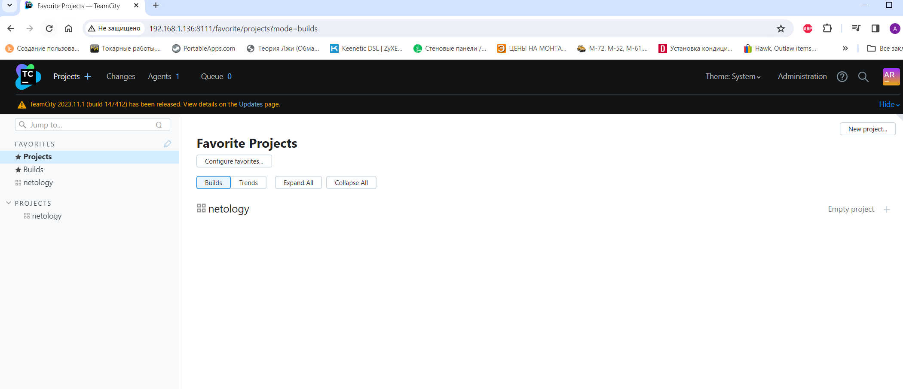
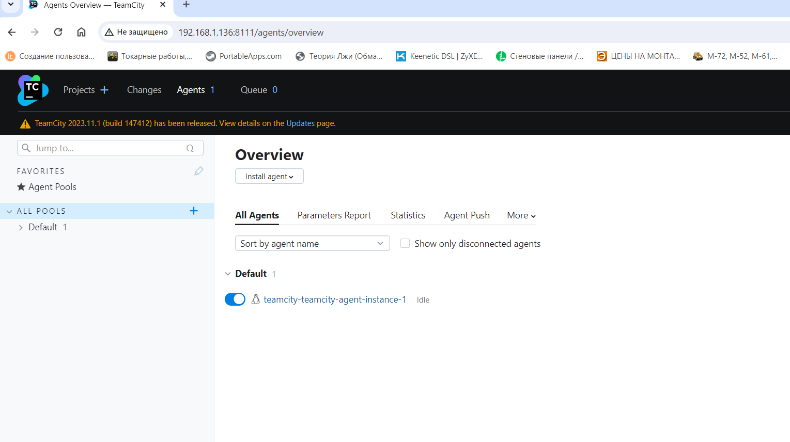
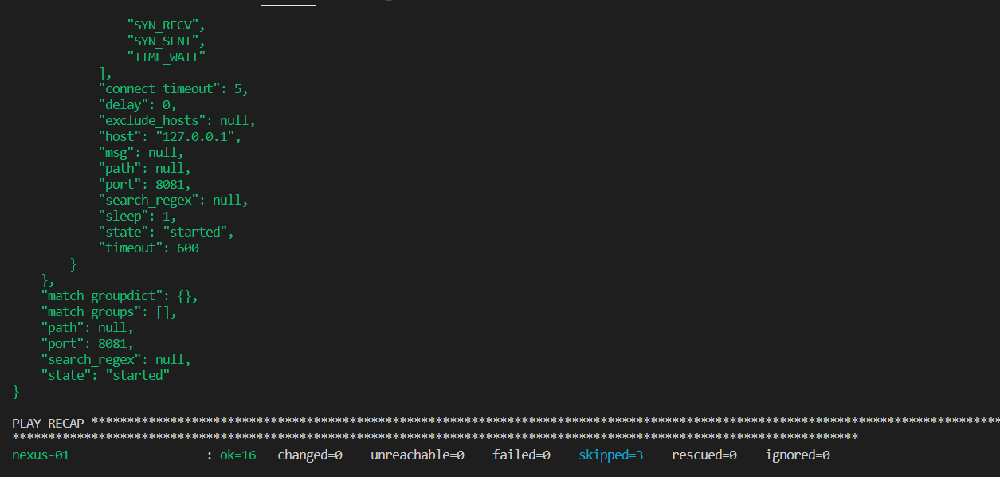
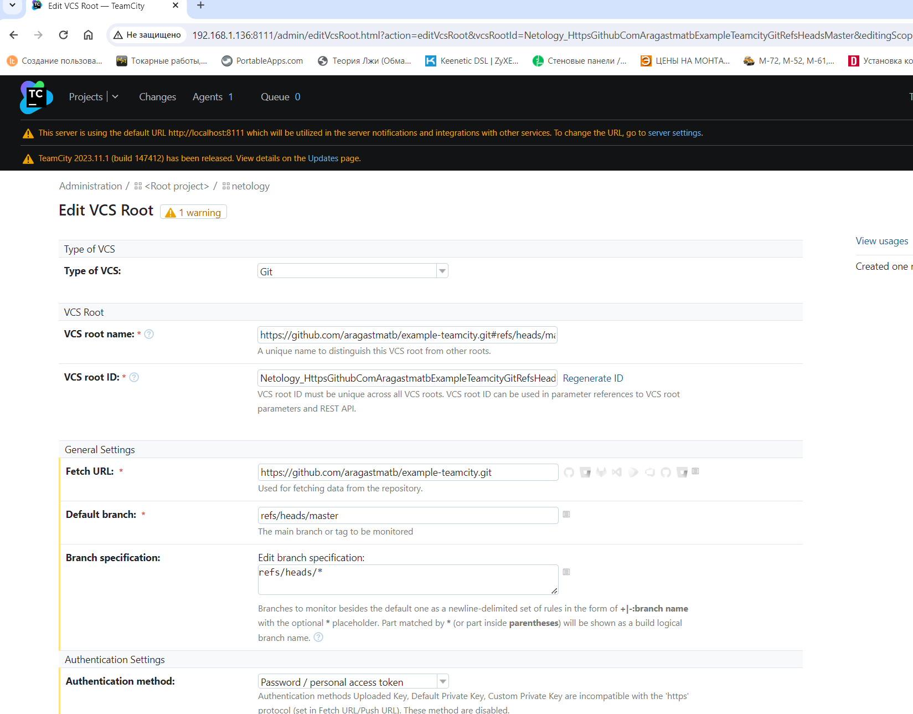
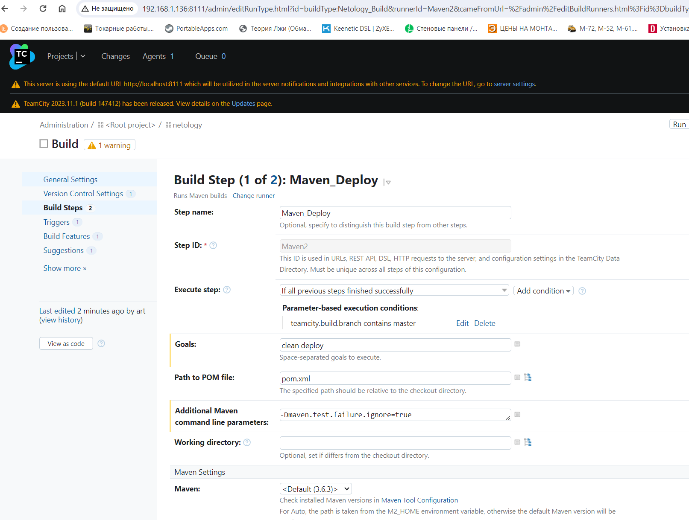
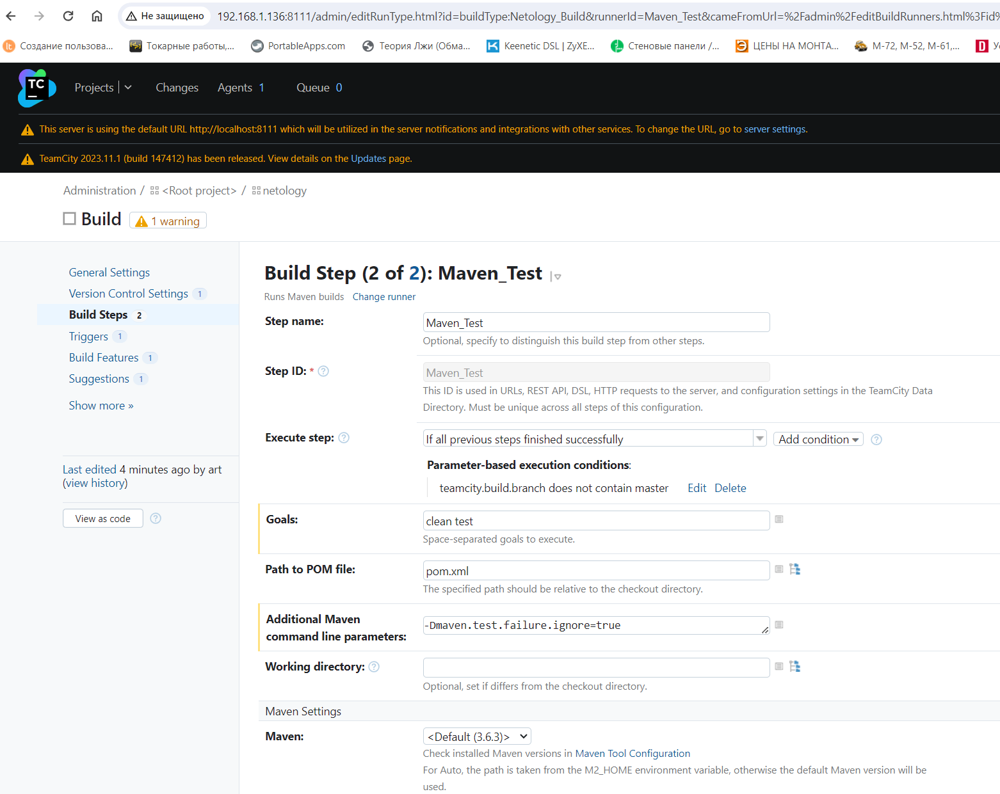
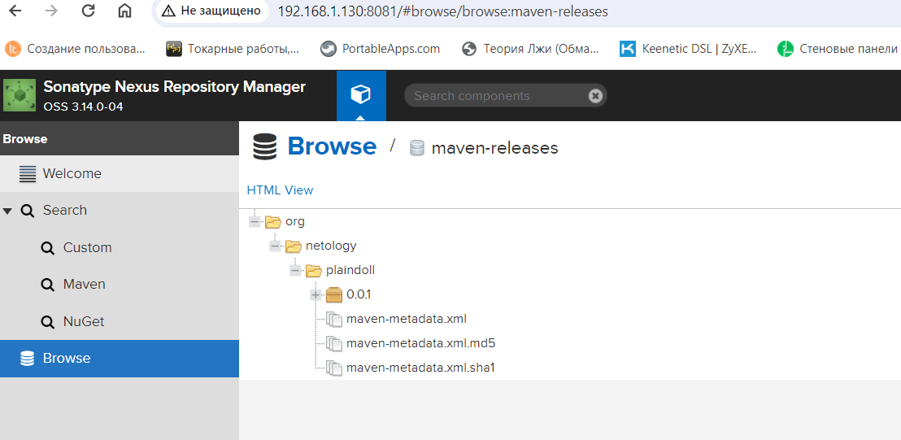
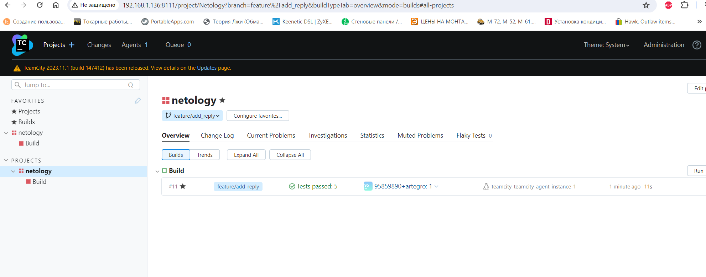
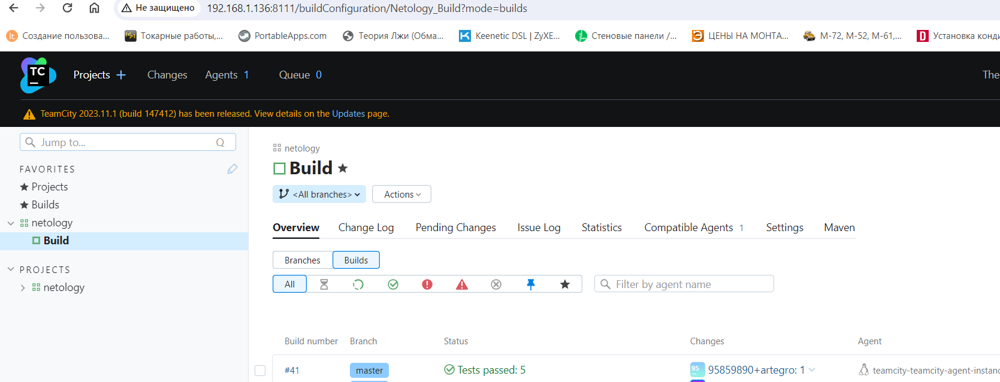

# Домашнее задание к занятию 11 «Teamcity»

## Подготовка к выполнению

1. В Yandex Cloud создайте новый инстанс (4CPU4RAM) на основе образа `jetbrains/teamcity-server`.
2. Дождитесь запуска teamcity, выполните первоначальную настройку.
3. Создайте ещё один инстанс (2CPU4RAM) на основе образа `jetbrains/teamcity-agent`. Пропишите к нему переменную окружения `SERVER_URL: "http://<teamcity_url>:8111"`.
4. Авторизуйте агент.
5. Сделайте fork [репозитория](https://github.com/aragastmatb/example-teamcity).
6. Создайте VM (2CPU4RAM) и запустите [playbook](./infrastructure).

### Выполнение подготовилеьной части
-   Поскольку в yandex сертификат кончился . то поднимает используем docker, и подготавливаем docker-compose.yml
```
version: '2'
services:
  teamcity-server-instance:
    image: jetbrains/teamcity-server
    ports:
     - "8111:8111"
    restart: always
    volumes:
      - '/home/artegro/Teamcity/test/teamcity/data:/data/teamcity_server/datadir'
      - '/home/artegro/Teamcity/test/teamcity/logs:/opt/teamcity/logs'
    networks:
      - teamcity-network
 
  teamcity-agent-instance:
    image: jetbrains/teamcity-agent
    restart: always
    volumes:
      - '/home/artegro/Teamcity/test/teamcity/agent-conf:/data/teamcity_agent/conf'
    environment:
      - SERVER_URL=teamcity-server-instance:8111
    networks:
      - teamcity-network
 
networks:
  teamcity-network:
```


-   Авторизуем агента


-   Создаем fork [репозитория](https://github.com/aragastmatb/example-teamcity.git)

-   Поготавливаем еще одну vm и запускаем на ней playbook


## Основная часть

1. Создайте новый проект в teamcity на основе fork.
2. Сделайте autodetect конфигурации.
3. Сохраните необходимые шаги, запустите первую сборку master.
4. Поменяйте условия сборки: если сборка по ветке `master`, то должен происходит `mvn clean deploy`, иначе `mvn clean test`.
5. Для deploy будет необходимо загрузить [settings.xml](./teamcity/settings.xml) в набор конфигураций maven у teamcity, предварительно записав туда креды для подключения к nexus.
6. В pom.xml необходимо поменять ссылки на репозиторий и nexus.
7. Запустите сборку по master, убедитесь, что всё прошло успешно и артефакт появился в nexus.
8. Мигрируйте `build configuration` в репозиторий.
9. Создайте отдельную ветку `feature/add_reply` в репозитории.
10. Напишите новый метод для класса Welcomer: метод должен возвращать произвольную реплику, содержащую слово `hunter`.
11. Дополните тест для нового метода на поиск слова `hunter` в новой реплике.
12. Сделайте push всех изменений в новую ветку репозитория.
13. Убедитесь, что сборка самостоятельно запустилась, тесты прошли успешно.
14. Внесите изменения из произвольной ветки `feature/add_reply` в `master` через `Merge`.
15. Убедитесь, что нет собранного артефакта в сборке по ветке `master`.
16. Настройте конфигурацию так, чтобы она собирала `.jar` в артефакты сборки.
17. Проведите повторную сборку мастера, убедитесь, что сбора прошла успешно и артефакты собраны.
18. Проверьте, что конфигурация в репозитории содержит все настройки конфигурации из teamcity.
19. В ответе пришлите ссылку на репозиторий.

---
### Основная часть решение

-   Создаем проект на основе fork



-   Меняем условия сборки , по master деплой


-   По другим веткам только тест 


-   Запускаем сборку


-   Смотрим артифакт в nexus


-  Выполняем действия с 8 по 14 и видим что сборка в teamcity прошла успешно сама
-   [build configuration](https://github.com/Artegro/example-teamcity/blob/master/.teamcity/Netology/buildTypes/Netology_Build.xml)


-   Исходя из  [докупентации](https://maven.apache.org/guides/introduction/introduction-to-the-lifecycle.html)  меняем команду с *mvn clean deploy*  на *clean package* так как в pom.xml у нас уже указан парамерт <package>jar 

-   Проверяем что всё прошло успешно


-   Последняя конфигурация проекта и сам проект в [Репозитории](https://github.com/Artegro/example-teamcity.git)


### Как оформить решение задания

Выполненное домашнее задание пришлите в виде ссылки на .md-файл в вашем репозитории.

---
