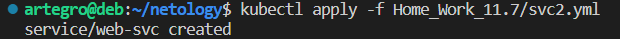

# Домашнее задание к занятию «Запуск приложений в K8S»

### Цель задания

В тестовой среде для работы с Kubernetes, установленной в предыдущем ДЗ, необходимо развернуть Deployment с приложением, состоящим из нескольких контейнеров, и масштабировать его.

------

### Чеклист готовности к домашнему заданию

1. Установленное k8s-решение (например, MicroK8S).
2. Установленный локальный kubectl.
3. Редактор YAML-файлов с подключённым git-репозиторием.

------

### Инструменты и дополнительные материалы, которые пригодятся для выполнения задания

1. [Описание](https://kubernetes.io/docs/concepts/workloads/controllers/deployment/) Deployment и примеры манифестов.
2. [Описание](https://kubernetes.io/docs/concepts/workloads/pods/init-containers/) Init-контейнеров.
3. [Описание](https://github.com/wbitt/Network-MultiTool) Multitool.

------

### Задание 1. Создать Deployment и обеспечить доступ к репликам приложения из другого Pod

1. Создать Deployment приложения, состоящего из двух контейнеров — nginx и multitool. Решить возникшую ошибку.
2. После запуска увеличить количество реплик работающего приложения до 2.
3. Продемонстрировать количество подов до и после масштабирования.
4. Создать Service, который обеспечит доступ до реплик приложений из п.1.
5. Создать отдельный Pod с приложением multitool и убедиться с помощью `curl`, что из пода есть доступ до приложений из п.1.

### Ответ

1.  Создаем [манифест](1.yml)

    Запускаем и видим ошибку

    

    Смотрим лог

    

    Немного гугления и выясняем что нам нехватате переменных в манифесте , дописываем [манифест](2.yml)  и запускаем

    

2.  Масштабируем до 2-х  меняем значение в файле 2.yml 
    ```
    kind: Deployment
        metadata:
            name: multi-dep
            namespace: default
        spec:
            replicas: 2
    ```
    Запускаем  
    

3.  Проверяем  
    

4.  Дописываем в файл [манифеста](2.yml) 
    ```
    ---
    apiVersion: v1
    kind: Service
    metadata:
    name: nmulti-svc
    spec:
    selector:
        app: multi
    ports:
    - name: web
        port: 80
        protocol: TCP
        targetPort: web
    - name: multi
        port: 8080
        protocol: TCP
        targetport: multi-port

    ```
    применяем  
    

    проверяем   
      

    

    Прокидываем порт и проверяем  
    nginx
      
      

    multitool  
      
      

5.  Создаем [манифест](3.yml) для отдельного пода и запускаем  
    

    Проверяем доступ из пода до наших приложении через сервис  
    
    

------

### Задание 2. Создать Deployment и обеспечить старт основного контейнера при выполнении условий

1. Создать Deployment приложения nginx и обеспечить старт контейнера только после того, как будет запущен сервис этого приложения.
2. Убедиться, что nginx не стартует. В качестве Init-контейнера взять busybox.
3. Создать и запустить Service. Убедиться, что Init запустился.
4. Продемонстрировать состояние пода до и после запуска сервиса.

### Ответ

1.  Создаем [манифест](Dep2.yml)  
2.  Проверяем  
     
3.  Создаем [манифест](svc2.yml) сервиса и зпускаем  
      
4.  Состояние пода до запуска сервиса
       

    И после запуска сервиса  
    
    ну и лог инит контейнера  
    
    


------

### Правила приема работы

1. Домашняя работа оформляется в своем Git-репозитории в файле README.md. Выполненное домашнее задание пришлите ссылкой на .md-файл в вашем репозитории.
2. Файл README.md должен содержать скриншоты вывода необходимых команд `kubectl` и скриншоты результатов.
3. Репозиторий должен содержать файлы манифестов и ссылки на них в файле README.md.


------