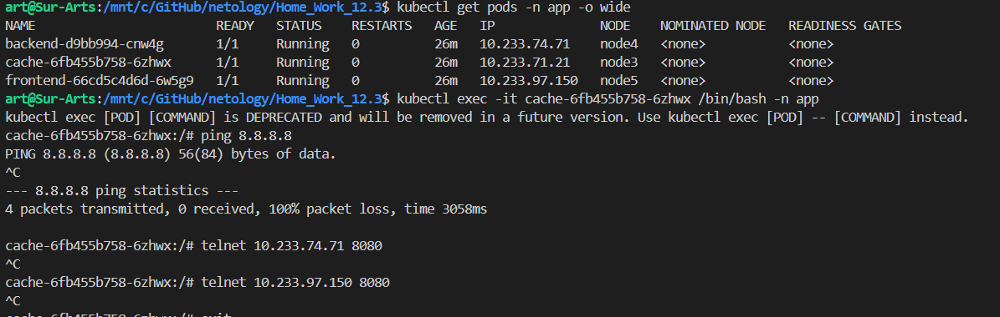

# Домашнее задание к занятию «Как работает сеть в K8s»

### Цель задания

Настроить сетевую политику доступа к подам.

### Чеклист готовности к домашнему заданию

1. Кластер K8s с установленным сетевым плагином Calico.

### Ответ  
*   Проверяем что у нас все готово  

### Инструменты и дополнительные материалы, которые пригодятся для выполнения задания

1. [Документация Calico](https://www.tigera.io/project-calico/).
2. [Network Policy](https://kubernetes.io/docs/concepts/services-networking/network-policies/).
3. [About Network Policy](https://docs.projectcalico.org/about/about-network-policy).

-----

### Задание 1. Создать сетевую политику или несколько политик для обеспечения доступа

1. Создать deployment'ы приложений frontend, backend и cache и соответсвующие сервисы.
2. В качестве образа использовать network-multitool.
3. Разместить поды в namespace App.
4. Создать политики, чтобы обеспечить доступ frontend -> backend -> cache. Другие виды подключений должны быть запрещены.
5. Продемонстрировать, что трафик разрешён и запрещён.

### Ответ  
* Создадим неймспейс  

    

* Подготовим файл манифесты для `front-end`, `back-end` и `cache`: [front](front.yml) [back](back.yml) [cache](cache.yml), так же подготовим манифесты `network policy`, сотвутственно: [back](npb.yml) [front](npf.yml) [cache](npc.yml) и запустим.

      
      

*   Проверяем  доступ с `front-end`: наружу, в back-end, и cache  

    
      

*   Аналогично проверяем с `back-end`, ping 8.8.8.8 , доступ к frontend и cache  

    
      

*   Поверяем доступ с `cache`,  ping 8.8.8.8 , доступ к backend и frontend

    

### Видим, что весь трафик у нас ходит согласно заданному условию в пункте 4.

### Правила приёма работы

1. Домашняя работа оформляется в своём Git-репозитории в файле README.md. Выполненное домашнее задание пришлите ссылкой на .md-файл в вашем репозитории.
2. Файл README.md должен содержать скриншоты вывода необходимых команд, а также скриншоты результатов.
3. Репозиторий должен содержать тексты манифестов или ссылки на них в файле README.md.