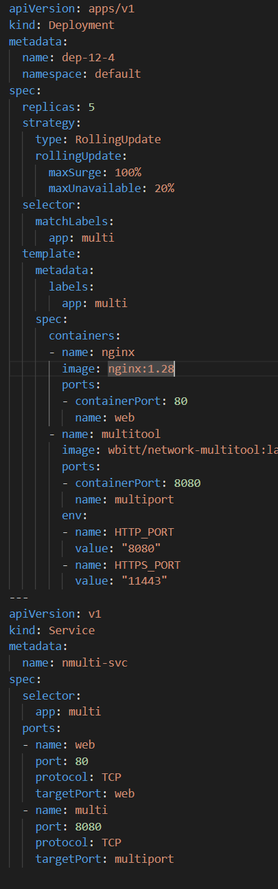

# Домашнее задание к занятию «Обновление приложений»

### Цель задания

Выбрать и настроить стратегию обновления приложения.

### Чеклист готовности к домашнему заданию

1. Кластер K8s.

### Инструменты и дополнительные материалы, которые пригодятся для выполнения задания

1. [Документация Updating a Deployment](https://kubernetes.io/docs/concepts/workloads/controllers/deployment/#updating-a-deployment).
2. [Статья про стратегии обновлений](https://habr.com/ru/companies/flant/articles/471620/).

-----

### Задание 1. Выбрать стратегию обновления приложения и описать ваш выбор

1. Имеется приложение, состоящее из нескольких реплик, которое требуется обновить.
2. Ресурсы, выделенные для приложения, ограничены, и нет возможности их увеличить.
3. Запас по ресурсам в менее загруженный момент времени составляет 20%.
4. Обновление мажорное, новые версии приложения не умеют работать со старыми.
5. Вам нужно объяснить свой выбор стратегии обновления приложения.

### Ответ:  
*   Смамым простым и первым вариантом напрашивается обновление политикой `Recreate`.  
    Плюсы:  
    *   мы не занимаем лишних ресурсов  
    *   если приложение небольшое то обновление проходит быстро  
    *   старые и новые верси приложания не пересекаются

    Минусы:  
    *   мы теряем доступность приложения на момент обновления  

*    Второй подход более на мой взгляд правильный обновление политикой `Canary` с переключением нагрузки шагом в 20%, что даст нам плавный переход и не будет взаимодейстивия разных версий приложения.  
    Плюсы:  
    *   Нет потери доступности  
    *   Плавный переход незаметный для пользователей  

*   Соответственно приходим к выводу что предпочтителен второй путь и потилика `Canary`   

### Задание 2. Обновить приложение

1. Создать deployment приложения с контейнерами nginx и multitool. Версию nginx взять 1.19. Количество реплик — 5.
2. Обновить версию nginx в приложении до версии 1.20, сократив время обновления до минимума. Приложение должно быть доступно.
3. Попытаться обновить nginx до версии 1.28, приложение должно оставаться доступным.
4. Откатиться после неудачного обновления.

### Ответ  
1.  Задание :  

    *   Возьмем для сокращения времени манифест с прошлых домашек и чутка подправим   
        

    *   Запустим и проверим  
          
          
          

2.  Задание  
    * Подправим манифест так , что бы у нас с политикой ролинг апдейт поднялись все 100% новых подов и потом переключились , по скольку мы не имеем ограничения в ресурсах.  
      
    
    *   Запустим и проверим   
      
    
    *   Проверим стратегию  
    

    * Посмотрим историю ревизий  
       

3.  Задание  
    * Подправим манифест  
      

    *   Запустим и посмотрим что будет  
      

      

    Получаем 5 новых под , которые не могут до конца стартовать и 4 старых  
    *   Проверим ревизии  
      

4. Откатываемся полсе неудачи  
      

    Видим, что произашел откат на предыдущую ревизию.  
    * Проверим поды.
    

## Дополнительные задания — со звёздочкой*

Задания дополнительные, необязательные к выполнению, они не повлияют на получение зачёта по домашнему заданию. **Но мы настоятельно рекомендуем вам выполнять все задания со звёздочкой.** Это поможет лучше разобраться в материале.   

### Задание 3*. Создать Canary deployment

1. Создать два deployment'а приложения nginx.
2. При помощи разных ConfigMap сделать две версии приложения — веб-страницы.
3. С помощью ingress создать канареечный деплоймент, чтобы можно было часть трафика перебросить на разные версии приложения.

### Правила приёма работы

1. Домашняя работа оформляется в своем Git-репозитории в файле README.md. Выполненное домашнее задание пришлите ссылкой на .md-файл в вашем репозитории.
2. Файл README.md должен содержать скриншоты вывода необходимых команд, а также скриншоты результатов.
3. Репозиторий должен содержать тексты манифестов или ссылки на них в файле README.md.