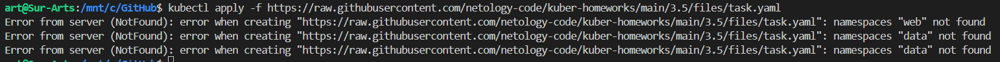
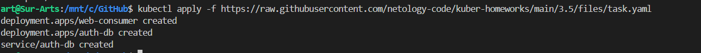
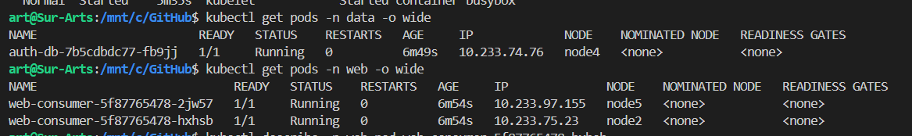
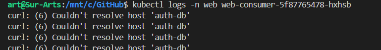
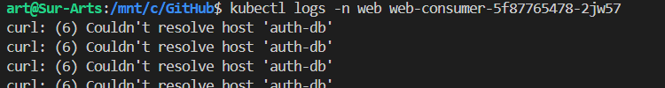
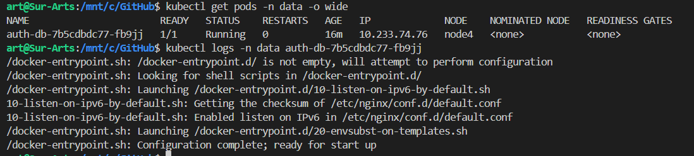
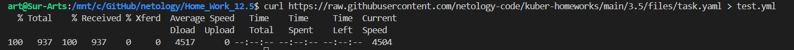
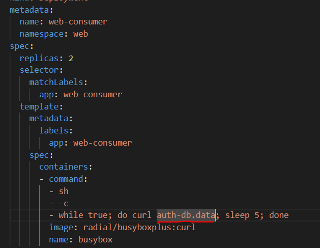
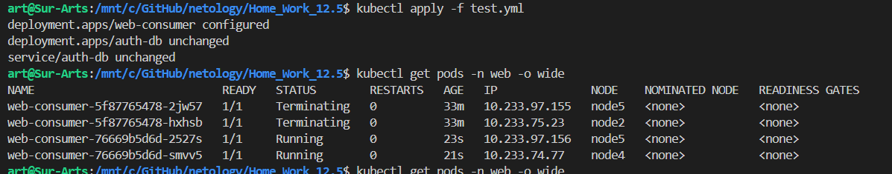
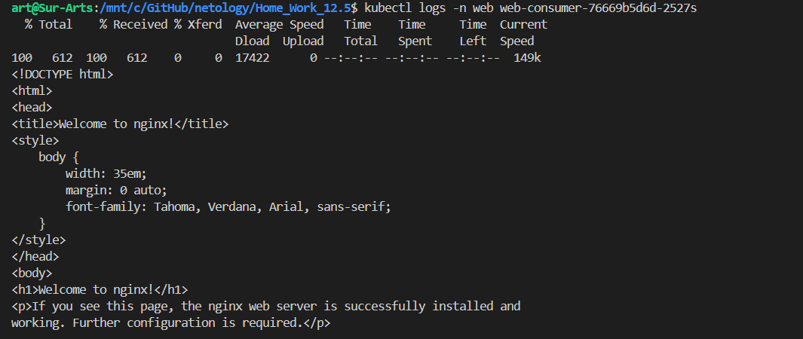

# Домашнее задание к занятию Troubleshooting

### Цель задания

Устранить неисправности при деплое приложения.

### Чеклист готовности к домашнему заданию

1. Кластер K8s.

### Задание. При деплое приложение web-consumer не может подключиться к auth-db. Необходимо это исправить

1. Установить приложение по команде:
```shell
kubectl apply -f https://raw.githubusercontent.com/netology-code/kuber-homeworks/main/3.5/files/task.yaml
```
2. Выявить проблему и описать.
3. Исправить проблему, описать, что сделано.
4. Продемонстрировать, что проблема решена.

### Ответ

1.  Запускаем и видим проблемку на старте

      

    *   Исправляем и запускаем повторно  
      

    *   Смотрим что запустилось  
      

    *   Смотрим в логи  контернеров  
      
      

2.   Видим что у нас контейнеры веб не могут отрезолвить dns имя `auth-db` и соответственно подключаться.  

    *   Смотрим логи контейнера `data`
      

    *   Тут все нормально , но есть одно но, у нас контейнеры `web-consumer`  в одном неймспейсе и контейнер к которому обращаются `auth-db` в другом.  
        Соответсвенно нам надо попарвить манифест.

3.  Скачиваем манифест и парвим  
      

    *    Правим строку обращения к `auth-db`, дописав к имени пода имя его неймспейса
      

    *   Запустим и проверим  
    

4.  Теперь заглянем в логи пода web и проверим чо всё работает

      

    *   Видим, что все получилось и ответ от пода  `auth-db` получен, все работает.

### Правила приёма работы

1. Домашняя работа оформляется в своём Git-репозитории в файле README.md. Выполненное домашнее задание пришлите ссылкой на .md-файл в вашем репозитории.
2. Файл README.md должен содержать скриншоты вывода необходимых команд, а также скриншоты результатов.
3. Репозиторий должен содержать тексты манифестов или ссылки на них в файле README.md.
