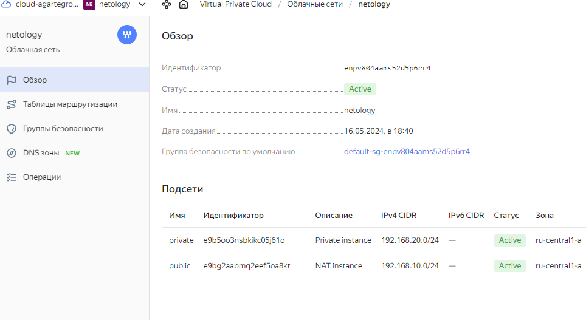

# Домашнее задание к занятию «Организация сети»

### Подготовка к выполнению задания

1. Домашнее задание состоит из обязательной части, которую нужно выполнить на провайдере Yandex Cloud, и дополнительной части в AWS (выполняется по желанию). 
2. Все домашние задания в блоке 15 связаны друг с другом и в конце представляют пример законченной инфраструктуры.  
3. Все задания нужно выполнить с помощью Terraform. Результатом выполненного домашнего задания будет код в репозитории. 
4. Перед началом работы настройте доступ к облачным ресурсам из Terraform, используя материалы прошлых лекций и домашнее задание по теме «Облачные провайдеры и синтаксис Terraform». Заранее выберите регион (в случае AWS) и зону.

### Подготовительная часть  
 
*   Проверим наличие тераформа  и утилиты yc оставшихся с прошлых лаб  
      
    
---
### Задание 1. Yandex Cloud 

**Что нужно сделать**

1. Создать пустую VPC. Выбрать зону.
2. Публичная подсеть.

 - Создать в VPC subnet с названием public, сетью 192.168.10.0/24.
 - Создать в этой подсети NAT-инстанс, присвоив ему адрес 192.168.10.254. В качестве image_id использовать fd80mrhj8fl2oe87o4e1.
 - Создать в этой публичной подсети виртуалку с публичным IP, подключиться к ней и убедиться, что есть доступ к интернету.
3. Приватная подсеть.
 - Создать в VPC subnet с названием private, сетью 192.168.20.0/24.
 - Создать route table. Добавить статический маршрут, направляющий весь исходящий трафик private сети в NAT-инстанс.
 - Создать в этой приватной подсети виртуалку с внутренним IP, подключиться к ней через виртуалку, созданную ранее, и убедиться, что есть доступ к интернету.

Resource Terraform для Yandex Cloud:

- [VPC subnet](https://registry.terraform.io/providers/yandex-cloud/yandex/latest/docs/resources/vpc_subnet).
- [Route table](https://registry.terraform.io/providers/yandex-cloud/yandex/latest/docs/resources/vpc_route_table).
- [Compute Instance](https://registry.terraform.io/providers/yandex-cloud/yandex/latest/docs/resources/compute_instance).


### Ответ

1.  Создаем файл terraform [плана](nods.tr) и запускаем команду terraform init  

      

2.  Запускает `plan`
```
    root@test:/home/artegro/ya/15.1# terraform plan

Terraform used the selected providers to generate the following execution plan. Resource actions are indicated with the following symbols:
  + create

Terraform will perform the following actions:

  # yandex_compute_instance.priv will be created
  + resource "yandex_compute_instance" "priv" {
      + created_at                = (known after apply)
      + folder_id                 = (known after apply)
      + fqdn                      = (known after apply)
      + gpu_cluster_id            = (known after apply)
      + hostname                  = (known after apply)
      + id                        = (known after apply)
      + maintenance_grace_period  = (known after apply)
      + maintenance_policy        = (known after apply)
      + metadata                  = {
          + "ssh-keys" = <<-EOT
                ubuntu:ssh-rsa AAAAB3Nza...
            EOT
        }
      + name                      = "privatevm"
      + network_acceleration_type = "standard"
      + platform_id               = "standard-v1"
      + service_account_id        = (known after apply)
      + status                    = (known after apply)
      + zone                      = "ru-central1-a"

      + boot_disk {
          + auto_delete = true
          + device_name = (known after apply)
          + disk_id     = (known after apply)
          + mode        = (known after apply)

          + initialize_params {
              + block_size  = (known after apply)
              + description = (known after apply)
              + image_id    = "fd80mrhj8fl2oe87o4e1"
              + name        = (known after apply)
              + size        = (known after apply)
              + snapshot_id = (known after apply)
              + type        = "network-hdd"
            }
        }

      + metadata_options {
          + aws_v1_http_endpoint = (known after apply)
          + aws_v1_http_token    = (known after apply)
          + gce_http_endpoint    = (known after apply)
          + gce_http_token       = (known after apply)
        }

      + network_interface {
          + index              = (known after apply)
          + ip_address         = (known after apply)
          + ipv4               = true
          + ipv6               = (known after apply)
          + ipv6_address       = (known after apply)
          + mac_address        = (known after apply)
          + nat                = false
          + nat_ip_address     = (known after apply)
          + nat_ip_version     = (known after apply)
          + security_group_ids = (known after apply)
          + subnet_id          = (known after apply)
        }

      + placement_policy {
          + host_affinity_rules       = (known after apply)
          + placement_group_id        = (known after apply)
          + placement_group_partition = (known after apply)
        }

      + resources {
          + core_fraction = 100
          + cores         = 2
          + memory        = 2
        }

      + scheduling_policy {
          + preemptible = (known after apply)
        }
    }

  # yandex_compute_instance.pub will be created
  + resource "yandex_compute_instance" "pub" {
      + created_at                = (known after apply)
      + folder_id                 = (known after apply)
      + fqdn                      = (known after apply)
      + gpu_cluster_id            = (known after apply)
      + hostname                  = (known after apply)
      + id                        = (known after apply)
      + maintenance_grace_period  = (known after apply)
      + maintenance_policy        = (known after apply)
      + metadata                  = {
          + "ssh-keys" = <<-EOT
                ubuntu:ssh-rsa AAAAB3Nza...
            EOT
        }
      + name                      = "publicvm"
      + network_acceleration_type = "standard"
      + platform_id               = "standard-v1"
      + service_account_id        = (known after apply)
      + status                    = (known after apply)
      + zone                      = "ru-central1-a"

      + boot_disk {
          + auto_delete = true
          + device_name = (known after apply)
          + disk_id     = (known after apply)
          + mode        = (known after apply)

          + initialize_params {
              + block_size  = (known after apply)
              + description = (known after apply)
              + image_id    = "fd80mrhj8fl2oe87o4e1"
              + name        = (known after apply)
              + size        = (known after apply)
              + snapshot_id = (known after apply)
              + type        = "network-hdd"
            }
        }

      + metadata_options {
          + aws_v1_http_endpoint = (known after apply)
          + aws_v1_http_token    = (known after apply)
          + gce_http_endpoint    = (known after apply)
          + gce_http_token       = (known after apply)
        }

      + network_interface {
          + index              = (known after apply)
          + ip_address         = "192.168.10.254"
          + ipv4               = true
          + ipv6               = (known after apply)
          + ipv6_address       = (known after apply)
          + mac_address        = (known after apply)
          + nat                = true
          + nat_ip_address     = (known after apply)
          + nat_ip_version     = (known after apply)
          + security_group_ids = (known after apply)
          + subnet_id          = (known after apply)
        }

      + placement_policy {
          + host_affinity_rules       = (known after apply)
          + placement_group_id        = (known after apply)
          + placement_group_partition = (known after apply)
        }

      + resources {
          + core_fraction = 100
          + cores         = 2
          + memory        = 2
        }

      + scheduling_policy {
          + preemptible = (known after apply)
        }
    }

  # yandex_vpc_network.network will be created
  + resource "yandex_vpc_network" "network" {
      + created_at                = (known after apply)
      + default_security_group_id = (known after apply)
      + folder_id                 = (known after apply)
      + id                        = (known after apply)
      + labels                    = (known after apply)
      + name                      = "netology"
      + subnet_ids                = (known after apply)
    }

  # yandex_vpc_route_table.net-rt will be created
  + resource "yandex_vpc_route_table" "net-rt" {
      + created_at = (known after apply)
      + folder_id  = (known after apply)
      + id         = (known after apply)
      + labels     = (known after apply)
      + network_id = (known after apply)

      + static_route {
          + destination_prefix = "0.0.0.0/0"
          + next_hop_address   = "192.168.10.254"
        }
    }

  # yandex_vpc_subnet.private-subnet will be created
  + resource "yandex_vpc_subnet" "private-subnet" {
      + created_at     = (known after apply)
      + description    = "Private instance"
      + folder_id      = (known after apply)
      + id             = (known after apply)
      + labels         = (known after apply)
      + name           = "private"
      + network_id     = (known after apply)
      + v4_cidr_blocks = [
          + "192.168.20.0/24",
        ]
      + v6_cidr_blocks = (known after apply)
      + zone           = "ru-central1-a"
    }

  # yandex_vpc_subnet.public-subnet will be created
  + resource "yandex_vpc_subnet" "public-subnet" {
      + created_at     = (known after apply)
      + description    = "NAT instance"
      + folder_id      = (known after apply)
      + id             = (known after apply)
      + labels         = (known after apply)
      + name           = "public"
      + network_id     = (known after apply)
      + v4_cidr_blocks = [
          + "192.168.10.0/24",
        ]
      + v6_cidr_blocks = (known after apply)
      + zone           = "ru-central1-a"
    }

Plan: 6 to add, 0 to change, 0 to destroy.
 ```

3.  Применяем `apply`

      

      

    *   Видим, что что то насоздавалось, проверим в консоле

        

          

          

          

    *   Попробуем теперь подключиться к публичной виртуалке и проверить

          

    *   А теперь подключимся к приватной виртуалке и проверим на ней.

         

    И видим, что  выход в интернеты у нас не работает.  
    Немного раздумий и понимаем что мы не присвоили маршрук к приватной сети, исправляем, дописываем стоку в файл.
        

    И меняем адрес шлюза жестко на статику виртуалки из публичной сети  
        

    *   Применяем  
          

    *   И проверяем 
          
    
    Теперь все работает как надо. Нормальный файл плана [тут](nods1.tr)

4. И после всех проделанных опираций очищаем все что насоздавали , чтоб не платить лишнее за ресурсы

      
    

    *   Проверяем на всякий в консоли яндекса и радуемся, что все потерлось и мы не будем платить лишнего.
        

---
### Задание 2. AWS* (задание со звёздочкой)

Это необязательное задание. Его выполнение не влияет на получение зачёта по домашней работе.

**Что нужно сделать**

1. Создать пустую VPC с подсетью 10.10.0.0/16.
2. Публичная подсеть.

 - Создать в VPC subnet с названием public, сетью 10.10.1.0/24.
 - Разрешить в этой subnet присвоение public IP по-умолчанию.
 - Создать Internet gateway.
 - Добавить в таблицу маршрутизации маршрут, направляющий весь исходящий трафик в Internet gateway.
 - Создать security group с разрешающими правилами на SSH и ICMP. Привязать эту security group на все, создаваемые в этом ДЗ, виртуалки.
 - Создать в этой подсети виртуалку и убедиться, что инстанс имеет публичный IP. Подключиться к ней, убедиться, что есть доступ к интернету.
 - Добавить NAT gateway в public subnet.
3. Приватная подсеть.
 - Создать в VPC subnet с названием private, сетью 10.10.2.0/24.
 - Создать отдельную таблицу маршрутизации и привязать её к private подсети.
 - Добавить Route, направляющий весь исходящий трафик private сети в NAT.
 - Создать виртуалку в приватной сети.
 - Подключиться к ней по SSH по приватному IP через виртуалку, созданную ранее в публичной подсети, и убедиться, что с виртуалки есть выход в интернет.

Resource Terraform:

1. [VPC](https://registry.terraform.io/providers/hashicorp/aws/latest/docs/resources/vpc).
1. [Subnet](https://registry.terraform.io/providers/hashicorp/aws/latest/docs/resources/subnet).
1. [Internet Gateway](https://registry.terraform.io/providers/hashicorp/aws/latest/docs/resources/internet_gateway).


### Правила приёма работы

Домашняя работа оформляется в своём Git репозитории в файле README.md. Выполненное домашнее задание пришлите ссылкой на .md-файл в вашем репозитории.
Файл README.md должен содержать скриншоты вывода необходимых команд, а также скриншоты результатов.
Репозиторий должен содержать тексты манифестов или ссылки на них в файле README.md.