# Дипломный практикум в Yandex.Cloud
  * [Цели:](#цели)
  * [Этапы выполнения:](#этапы-выполнения)
     * [Создание облачной инфраструктуры](#создание-облачной-инфраструктуры)
     * [Создание Kubernetes кластера](#создание-kubernetes-кластера)
     * [Создание тестового приложения](#создание-тестового-приложения)
     * [Подготовка cистемы мониторинга и деплой приложения](#подготовка-cистемы-мониторинга-и-деплой-приложения)
     * [Установка и настройка CI/CD](#установка-и-настройка-cicd)
  * [Что необходимо для сдачи задания?](#что-необходимо-для-сдачи-задания)
  * [Как правильно задавать вопросы дипломному руководителю?](#как-правильно-задавать-вопросы-дипломному-руководителю)

**Перед началом работы над дипломным заданием изучите [Инструкция по экономии облачных ресурсов](https://github.com/netology-code/devops-materials/blob/master/cloudwork.MD).**

---
## Цели:

1. Подготовить облачную инфраструктуру на базе облачного провайдера Яндекс.Облако.
2. Запустить и сконфигурировать Kubernetes кластер.
3. Установить и настроить систему мониторинга.
4. Настроить и автоматизировать сборку тестового приложения с использованием Docker-контейнеров.
5. Настроить CI для автоматической сборки и тестирования.
6. Настроить CD для автоматического развёртывания приложения.

---
## Этапы выполнения:


### Создание облачной инфраструктуры

Для начала необходимо подготовить облачную инфраструктуру в ЯО при помощи [Terraform](https://www.terraform.io/).

Особенности выполнения:

- Бюджет купона ограничен, что следует иметь в виду при проектировании инфраструктуры и использовании ресурсов;
Для облачного k8s используйте региональный мастер(неотказоустойчивый). Для self-hosted k8s минимизируйте ресурсы ВМ и долю ЦПУ. В обоих вариантах используйте прерываемые ВМ для worker nodes.
- Следует использовать версию [Terraform](https://www.terraform.io/) не старше 1.5.x .

Предварительная подготовка к установке и запуску Kubernetes кластера.

1. Создайте сервисный аккаунт, который будет в дальнейшем использоваться Terraform для работы с инфраструктурой с необходимыми и достаточными правами. Не стоит использовать права суперпользователя
2. Подготовьте [backend](https://www.terraform.io/docs/language/settings/backends/index.html) для Terraform:  
   а. Рекомендуемый вариант: S3 bucket в созданном ЯО аккаунте(создание бакета через TF)
   б. Альтернативный вариант:  [Terraform Cloud](https://app.terraform.io/)  
3. Создайте VPC с подсетями в разных зонах доступности.
4. Убедитесь, что теперь вы можете выполнить команды `terraform destroy` и `terraform apply` без дополнительных ручных действий.
5. В случае использования [Terraform Cloud](https://app.terraform.io/) в качестве [backend](https://www.terraform.io/docs/language/settings/backends/index.html) убедитесь, что применение изменений успешно проходит, используя web-интерфейс Terraform cloud.

Ожидаемые результаты:

1. Terraform сконфигурирован и создание инфраструктуры посредством Terraform возможно без дополнительных ручных действий.
2. Полученная конфигурация инфраструктуры является предварительной, поэтому в ходе дальнейшего выполнения задания возможны изменения.

---

### Выполнение (работу над ошибками дописана под каждым пунктом задания к которому были замечания, насколько я правильно их понял), так же прошу учесть, что работы делал пошагово для каждого этапа и ответы строил исходя из пункта `Ожидаемый результат:` для кождого этапа, что могло привести к путанице проверяющего.


1.   ### Подготовим для начала машину
    
<details> 
       <summary> Выполнение подготовки машины с которой будем работать</summary>  


*    Cтавим [terraform](https://releases.hashicorp.com/terraform/1.5.0/terraform_1.5.0_linux_amd64.zip)     копикуем ахив, закидываем бинарник и немного разбираемся с правами, так как мы не хотим работать из под root-та версии 1.5.0  
    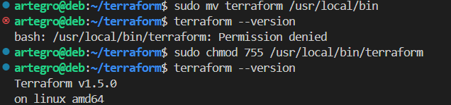   

*   Далее [yc](https://yandex.cloud/ru/docs/cli/operations/install-cli) тут все просто , идем по инструкции
    ```
     curl -sSL https://storage.yandexcloud.net/yandexcloud-yc/install.sh | bash

    ```
    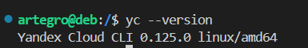

*  Настроим и подготовим сервис аккаунт

   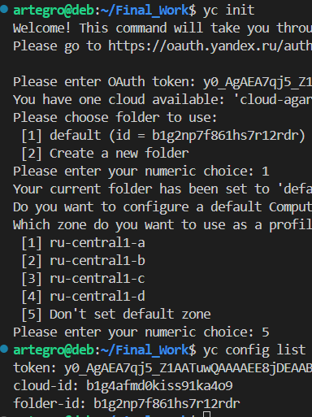  
   Зону по умолчанию не ставим, в дальнейшем все ровно будем разносить в разные зоны все хосты.

   Создаем сервис аккаунт и назначим ему права
     
   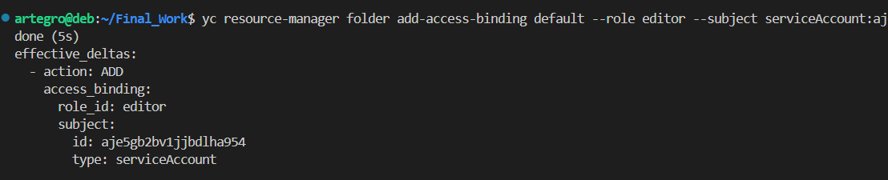  
   Подготовим профиль для работы тераформа.  
   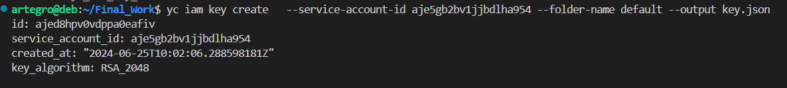  
   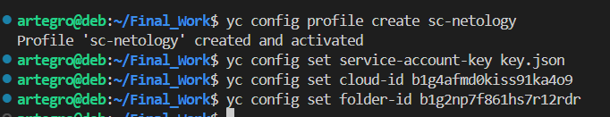  

   Установим переменные
   ```
      export YC_TOKEN=$(yc iam create-token)
      export YC_CLOUD_ID=$(yc config get cloud-id)
      export YC_FOLDER_ID=$(yc config get folder-id)
      export ACCESS_KEY="<идентификатор_ключа>"
      export SECRET_KEY="<секретный_ключ>"
   ```
   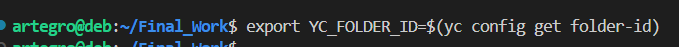  
   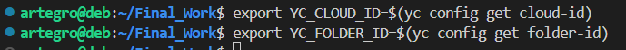  
   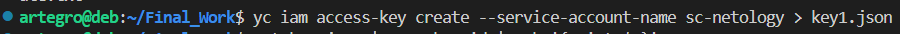  
   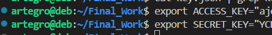  

   Создадим конфигурационный файл с содержимым  
   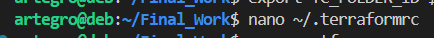  
   ```
   provider_installation {
      network_mirror {
         url = "https://terraform-mirror.yandexcloud.net/"
         include = ["registry.terraform.io/*/*"]
      }
      direct {
         exclude = ["registry.terraform.io/*/*"]
      }
   }
   ```  
</details>    

<details> 
   <summary>Выполнение подготовки, подготовка бакета</summary>  

*  Перейдем к манифестам и подготовки инфраструктуры   

   Добавим тестово файл [Манифест](./s3baket/yc.tf) и выполним terraform init  
   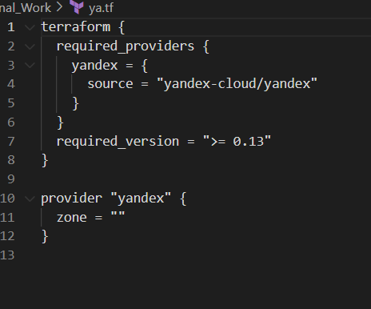  
     

   Создадим  с самими хранилищем для s3 [Манифест](./s3baket/s3-create.tf)  
   далее запускаем и проверяем  
   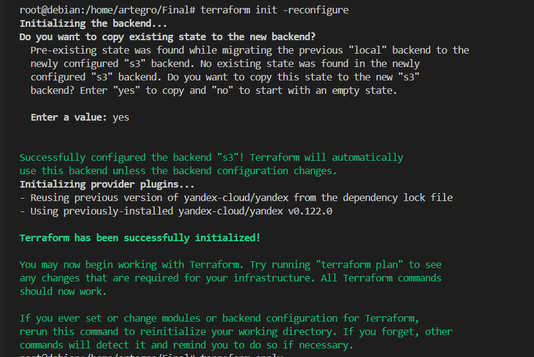  
     
   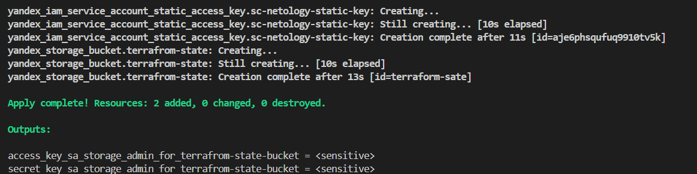  
   Проверяем в консоле yc что все появилось  
   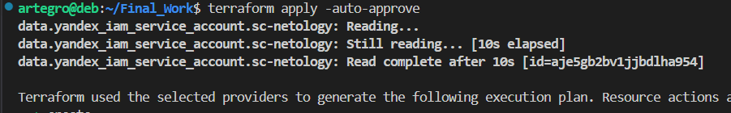  
   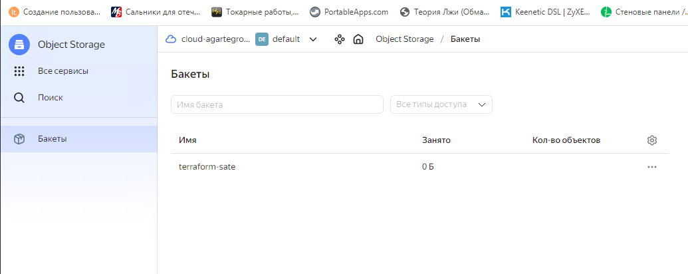 

   Удалим, и то же проверим 
   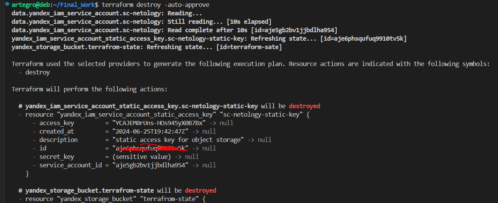  
   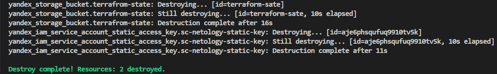
   Проверяем в консоле yc что все появилось  
   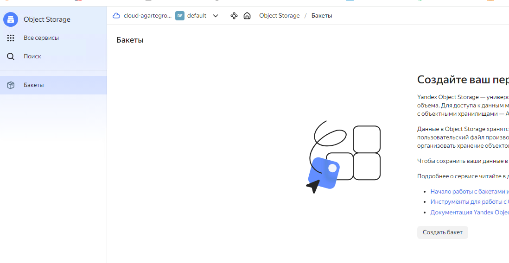  

   Видим что всё работает, Теперь еще раз создадим 
   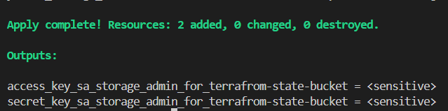  


   И далее применяем [Манифест](./s3baket/s3.tf_) бакенд  
   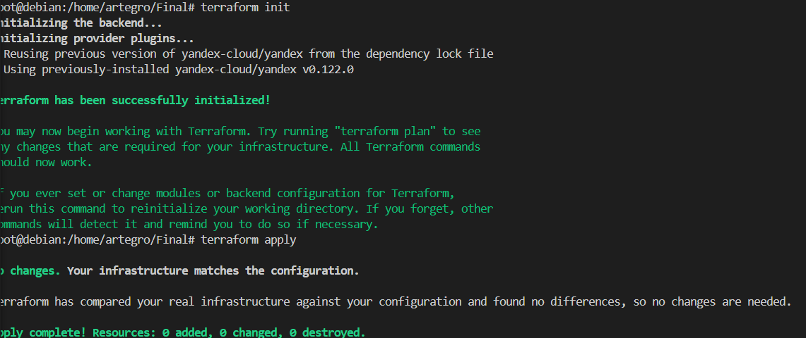  

   Проверяем в консоле yc что все появилось  
     
   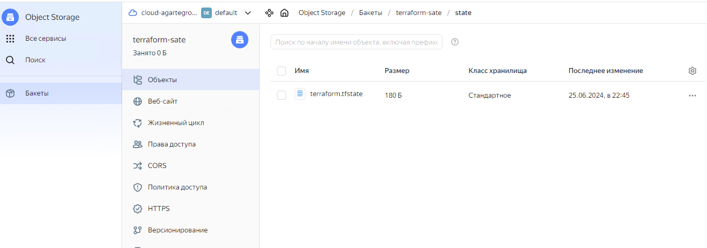   


   Надо отметить, что как только мы перенесли бакенд в яндекс бакет, теперь при удалении бакет удаляться не будет, так как в нем теперь есть данные.

</details>    

*  **Работа над ошибками**
   *  `2 Не понимаю, у вас все терраформ файлы в корне. Если сделать terrafrom plan с нуля (я склонирую ваш код и запущу у себя) - то я получу инфраструктуру?  `

      *  Ответ:  
      На этом шаге мы создаем только бакет, по скольку нам сначала надо создать объект в `Yandex Cloud` и только потом перенастроить в него бакет Terraforma, подготовлен скрипт [](./s3baket/install_backet.sh).  
      Можно скопировать всю папку, сделать скрипт исполняемым и запустить, создасться объект s3 в `Yandex Cloud` и перенастроится бакет.  

   *  Надо отметить, что как только мы перенесли бакенд в яндекс бакет, теперь при удалении бакет удаляться не будет  
      `3 Какая-то ошибка будет?`
      *  Если сделать просто `terraform destroy -auto-approve`, то ошибок нет , все проходит и бакет остается в облаке.  
      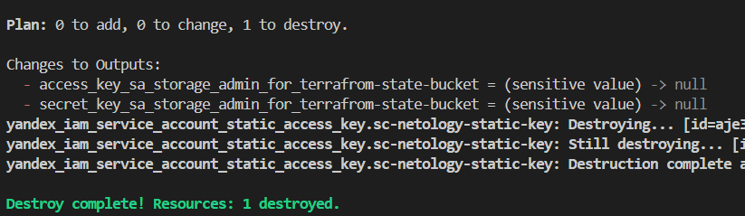  
      Но если сначала перенастроить вывод бакета обратно локально, то мы получим ошибку  о которой писал выше.  
      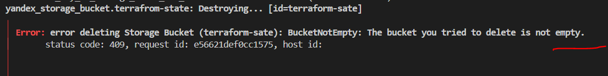

<details>  
   <summary>Выполнение подготовки, Создайте VPC с подсетями в разных зонах доступности</summary>  

   *  Создаем [Манифест](./s3baket/vm.tf_) с 3-мя виртуалками, поместим его в папку с остальными манифестами, для этого возьмем манифест из прошлых домашек и слегка переделаем.  
   Заускаем и проверяем  
   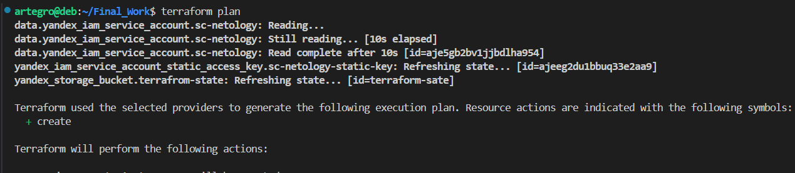  
   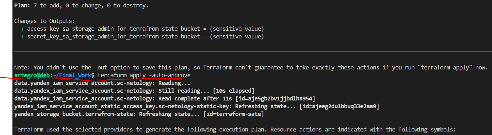  
   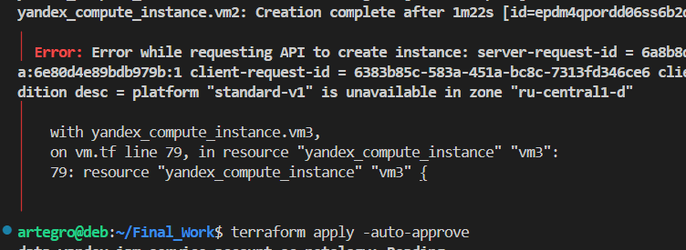  
   Обнаруживаем что 3-я машина не создалась, чутка гуглим и выясняем что в зоне d есть только стандарт v2 b v3 , правим файл и повторно запускаем  
   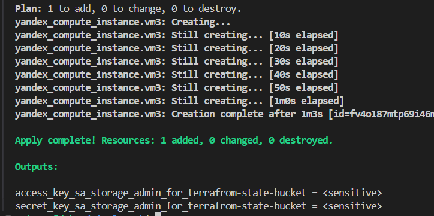  
   В этот раз видим что всё создалось, проверяем в консоле  
   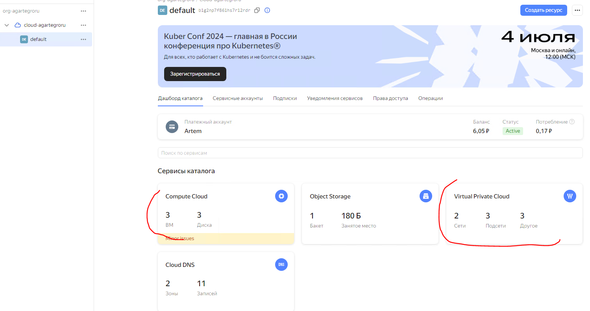  
   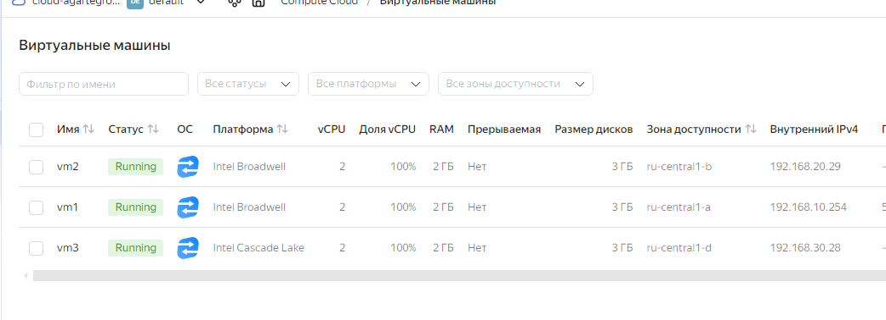  

   Теперь удаляем всё что понаделали чтоб не платить лишнего.
   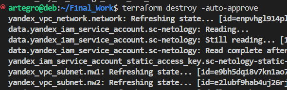  

   Видим что удалилось все кроме бакета  
   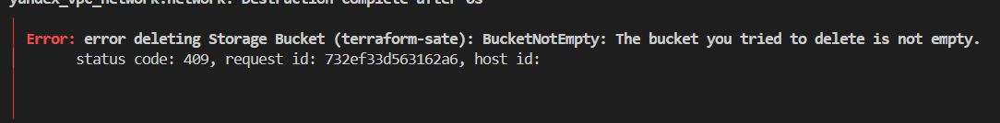  

   Ну и в граф консоле  
   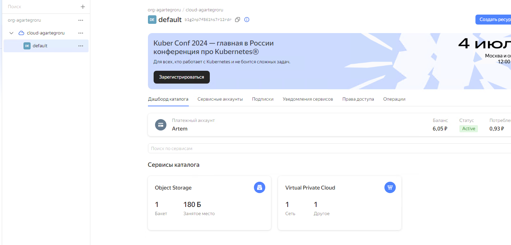  


   На этом подготовительную часть можно закончить.  

</details>   

*  **Работа над ошибками**
   
   *  `2 Не понимаю, у вас все терраформ файлы в корне. Если сделать terrafrom plan с нуля (я склонирую ваш код и запущу у себя) - то я получу инфраструктуру?  `
      *  Ответ:  
      На данном этапе скопировав папку ./s3baket и по очереди запустив 2 скрипта [install_backet.sh](./s3baket/install_backet.sh) и  [install-infra.sh](./s3baket/install-infra.sh) мы получаем инфраструктуру, так же далее можем спакойно находясь в этой папке делать `terraform destroy` `terraform apply`, создавая и удаляя инфраструктуру, описанную выше.  

   *  `4 Давайте придерживаться принципа DRY (do not repeat yourself) и не копипастить сети и ВМ` 
      *  Ответ:  
      Не много не понял замечания. Возможно это из за последующего их дублирования в файлах nods.tf и nw.tf

   *  `5 Кроме того, я бы вынес и параметры ВМ (ЦПУ, память, версию ОС и пр) в variables`
      *  Ответ:  
      Изначально даже не подумал о таком варианте, спасибо это может быть полезно, пока моим девизом было чем проще тем лучше ну и давящие сроки.
      В дальнейшем мы будем бить виртуальные машины на группы, и по группам далее будет различия по параметрам как минимум памяти, так что в нашем случае не сильно актуально на текущий момент.

### Создание Kubernetes кластера

На этом этапе необходимо создать [Kubernetes](https://kubernetes.io/ru/docs/concepts/overview/what-is-kubernetes/) кластер на базе предварительно созданной инфраструктуры.   Требуется обеспечить доступ к ресурсам из Интернета.

Это можно сделать двумя способами:

1. Рекомендуемый вариант: самостоятельная установка Kubernetes кластера.  
   а. При помощи Terraform подготовить как минимум 3 виртуальных машины Compute Cloud для создания Kubernetes-кластера. Тип виртуальной машины следует выбрать самостоятельно с учётом требовании к производительности и стоимости. Если в дальнейшем поймете, что необходимо сменить тип инстанса, используйте Terraform для внесения изменений.  
   б. Подготовить [ansible](https://www.ansible.com/) конфигурации, можно воспользоваться, например [Kubespray](https://kubernetes.io/docs/setup/production-environment/tools/kubespray/)  
   в. Задеплоить Kubernetes на подготовленные ранее инстансы, в случае нехватки каких-либо ресурсов вы всегда можете создать их при помощи Terraform.
2. Альтернативный вариант: воспользуйтесь сервисом [Yandex Managed Service for Kubernetes](https://cloud.yandex.ru/services/managed-kubernetes)  
  а. С помощью terraform resource для [kubernetes](https://registry.terraform.io/providers/yandex-cloud/yandex/latest/docs/resources/kubernetes_cluster) создать **региональный** мастер kubernetes с размещением нод в разных 3 подсетях      
  б. С помощью terraform resource для [kubernetes node group](https://registry.terraform.io/providers/yandex-cloud/yandex/latest/docs/resources/kubernetes_node_group)
  
Ожидаемый результат:

1. Работоспособный Kubernetes кластер.
2. В файле `~/.kube/config` находятся данные для доступа к кластеру.
3. Команда `kubectl get pods --all-namespaces` отрабатывает без ошибок.

### Выполнение  


*  Мы жадные по этому идем по пути `yc cli` `terraform` `kubesray`, немного обращаемся к гуглу и находим замечателный [гайд](https://git.cloud-team.ru/lections/kubernetes_setup) возьмем его за основу которой пойдем переделав под себя. 


<details>   
   <summary>Выполнение Создание Kubernetes кластера </summary>  

*  Добавим наш [бакет](https://github.com/Artegro/yc-infra/blob/main/infra/terraform/s3backet.tf) в каталог с манифестами.  

*  От разбивки по разным манифестам в итоге отказался , посотянно выпалада ошибка на незадикларированные модули.  
   Правим [inventery](https://github.com/Artegro/yc-infra/blob/main/infra/terraform/k8s-cluster.tf) меняем образ и колличество мастер нод.  
   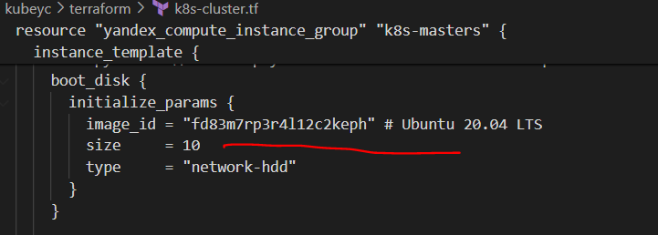  

   Колличество мастер нод и политику их пересоздания, по скольку нам не важна пока отказоустойчивость.  
   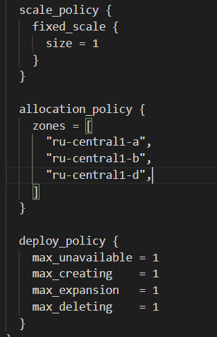  

   Закидываем переменные для терраформа [private.auto.tfvars](https://github.com/Artegro/yc-infra/blob/main/infra/terraform/private.auto.tfvars).  
   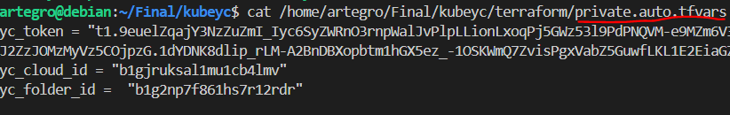  

   И правим немного скрипт динамического инвентери для плейбука [generate_inventory.sh](https://github.com/Artegro/yc-infra/blob/main/infra/terraform/generate_inventory.sh).  
   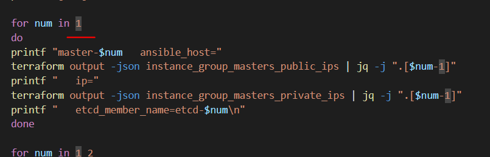  
   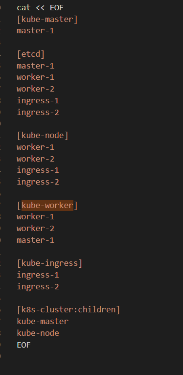  

   В переменных кластера [k8s-cluster.yml](https://github.com/Artegro/yc-infra/blob/0d5f8328ec8376a3aa1944f98b0c42d9d834e583/infra/kubespray_inventory/group_vars/k8s-cluster/k8s-cluster.yml#L23C2-L23C22) меняем версию кубера и проверяем сетевой плангин [k8s-cluster.yml](https://github.com/Artegro/yc-infra/blob/0d5f8328ec8376a3aa1944f98b0c42d9d834e583/infra/kubespray_inventory/group_vars/k8s-cluster/k8s-cluster.yml#L75C1-L75C28).  
   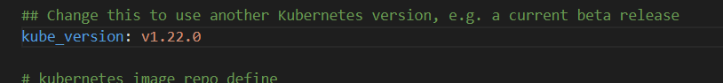  
   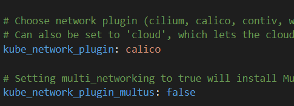

   Далее скачаем и подготовим `kubesray`  [sprayget.sh](https://github.com/Artegro/yc-infra/blob/main/infra/sprayget.sh).  
   Изменим зависимости в файле [requirements.txt](https://github.com/Artegro/yc-infra/blob/main/infra/kubespray/requirements-2.12.txt).  
   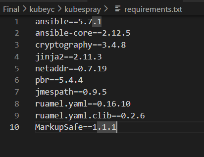  

   Немного правим [скрипт](https://github.com/Artegro/yc-infra/blob/main/infra/cluster_install.sh) установки кластера и заускаем.  

   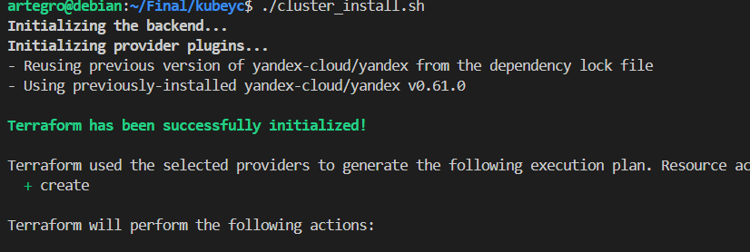

   И после получаса ожидания наблюдаем следующее.  
   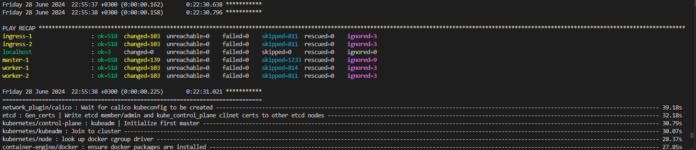

   Проверим в web консоле.  
   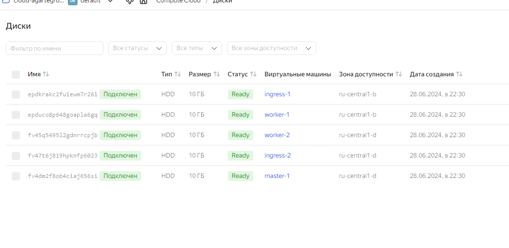  
   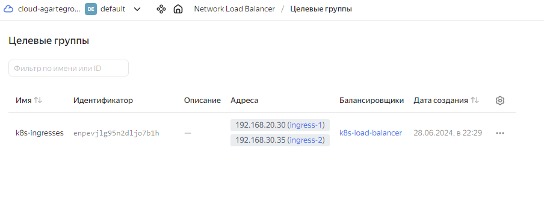

   Ну и в терминале.  
   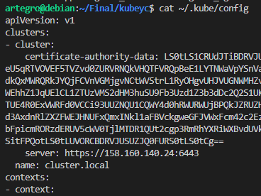  
   
   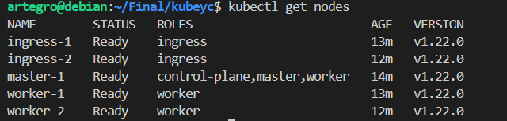  

*  Проверили и теперь удаляем кластер.  
   Так же , что б не писать руками команды используем [скрипт](https://github.com/Artegro/yc-infra/blob/main/infra/cluster_destroy.sh).  
   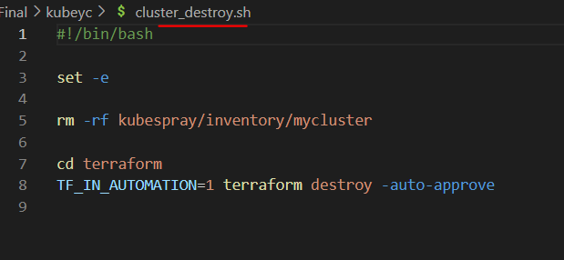  

   Запускаем.  
   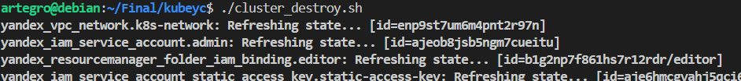
   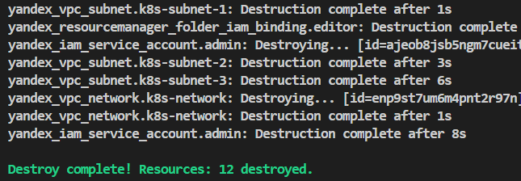  

   Проверяем, остался один бакет, как и говорил ранее.  
   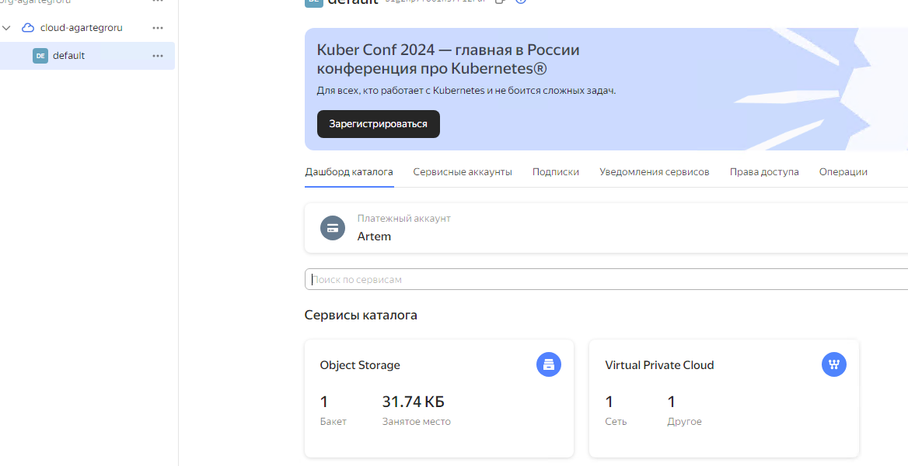 

</details> 

*  **Работа над ошибками**
   
   *  `6 Правим inventery меняем образ и колличество мастер нод. Файл пустой`  
      *  Ответ:  
      Исправленно в ответе , так же дублирую ссылку тут [inventery](https://github.com/Artegro/yc-infra/blob/main/infra/terraform/k8s-cluster.tf)  

   *  `7 И правим немного скрипт динамического инвентери для плейбука. Не нашел этот скрипт` 
      *  Ответ:  
      Исправленно в ответе , так же дублирую ссылку тут [generate_inventory.sh](https://github.com/Artegro/yc-infra/blob/main/infra/terraform/generate_inventory.sh)  
   
   *  `8 Для чего нужен файл nods.tf и чем он отличается от vm.tf?` и `9 Аналогично для nw.tf? Что это и для чего?`
      *  Ответ:  
      Данные файлы забытые артифакты от установки одного из вариантов инвраструктуры, следы моей невнимательности.  
      Исправлено.  

   *  Далее скачаем и подготовим kubesray sprayget.sh. Немного правим скрипт установки кластера и заускаем  
      `10 Внутри этого скрипта какой-то еще скрипт generate_inventory.sh. Где он и зачем, я не понял. Где плейбуки кубспрея я тоже не нашел. Я запутался что зачем и как это работает… Простите`
      *  Ответ:  
      Это скрипт денамического инвентори для ansible поправлен в ответе и ссылка тут [generate_inventory.sh](https://github.com/Artegro/yc-infra/blob/main/infra/terraform/generate_inventory.sh), он получает от тераформа данные ip адресов и генерирует на их основе инветрени и далее они копируются в папку кубспрея с переменными для настройки кластера  из [этой директории](https://github.com/Artegro/yc-infra/tree/main/infra/kubespray_inventory).   
      Основная дерриктория [kubspray](https://github.com/Artegro/yc-infra/tree/main/infra/kubespray)  

   *  Ну и в вебке по адресу балансировщика.  
      `11 Где и как балансировщик появился? Где его настройки?`

      *  Ответ  
         Это следствие того, что файл `inventery` был пуст, сейчас исправлено в ответе, и так же ссылка тут [k8s-cluster.tf](https://github.com/Artegro/yc-infra/blob/1cc5cfc648cfea676276a6e1d071bc1cddd9a1a8/infra/terraform/k8s-cluster.tf#L325C1-L325C63)  

   
      
---
### Создание тестового приложения

Для перехода к следующему этапу необходимо подготовить тестовое приложение, эмулирующее основное приложение разрабатываемое вашей компанией.

Способ подготовки:

1. Рекомендуемый вариант:  
   а. Создайте отдельный git репозиторий с простым nginx конфигом, который будет отдавать статические данные.  
   б. Подготовьте Dockerfile для создания образа приложения.  
2. Альтернативный вариант:  
   а. Используйте любой другой код, главное, чтобы был самостоятельно создан Dockerfile.

Ожидаемый результат:

1. Git репозиторий с тестовым приложением и Dockerfile.
2. Регистри с собранным docker ./img/image. В качестве регистри может быть DockerHub или [Yandex Container Registry](https://cloud.yandex.ru/services/container-registry), созданный также с помощью terraform.

### Выполнение  
<details>  
   <summary>Создание тестового приложения</summary>  

 * Подготовим файлы за образ, пока берем стандарный конфиг по сути там менять нечего только заменить index.html [Dockerfile](./testapp/Dockerfile) [index.html](./testapp/index.html)  
   Создаем образ пушим в DockerHub и проверяем, развернем сразу в кластере [Манифест](./testapp/testapp.yml).   
   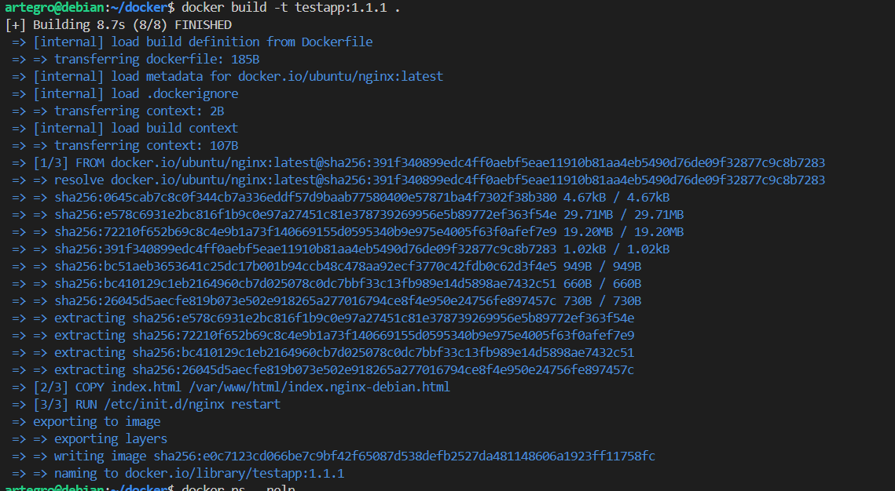  
   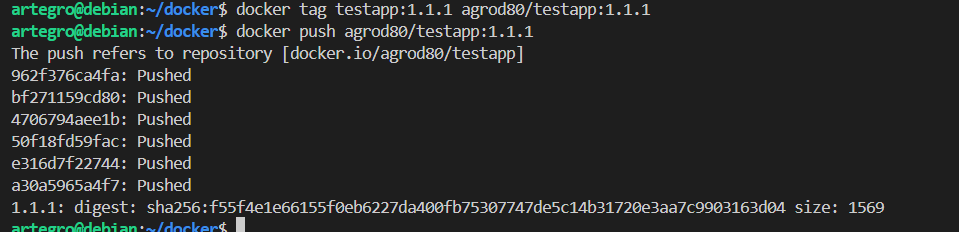  
   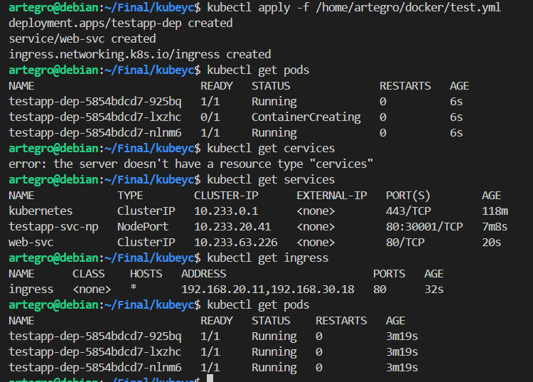  

   Ну и в вебке по адресу балансировщика.  
   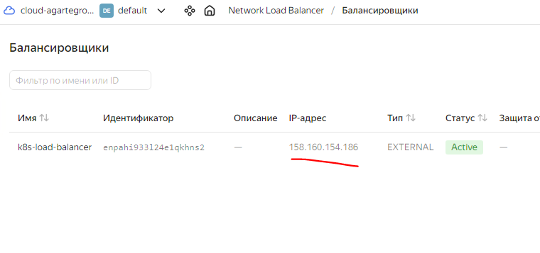  
   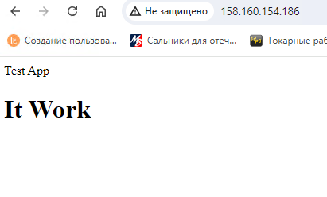


*  Все файлы и манифесты выше, [ссылка](https://hub.docker.com/r/agrod80/testapp) на репозиторий.
</details>


*  **Работа над ошибками**
   
   *  `12 В манифесте вы используете ингресс. Где его настройки? Как он деплоился?`  
      *  Ответ  
      Это следствие того, что файл `inventery` был пуст, сейчас исправлено в ответе, и так же ссылка тут [k8s-cluster.tf](https://github.com/Artegro/yc-infra/blob/1cc5cfc648cfea676276a6e1d071bc1cddd9a1a8/infra/terraform/k8s-cluster.tf#L247C1-L247C59)  

   *  `12 В том же файле у вас захардкожена версия 1.1.1. А как вы обеспечиваете версионность приложения?`  
      *  Ответ
      На данном этапе было создано приложение и опробованна возможность его разворачивания в k8s, возможность версионирования будет добавленна дальше уже в pipelines gitlaba, на данный момент выполнения работы, который еще не был поднят. На конечный момент выполнения работы манифест для тестового приложения динамически создается в [gitlab-ci.yml](http://gitlab.artegro.ru/netology/testapp/-/blob/main/.gitlab-ci.yml?ref_type=heads) на шаге `deploy`

---
### Подготовка cистемы мониторинга и деплой приложения

Уже должны быть готовы конфигурации для автоматического создания облачной инфраструктуры и поднятия Kubernetes кластера.  
Теперь необходимо подготовить конфигурационные файлы для настройки нашего Kubernetes кластера.

Цель:
1. Задеплоить в кластер [prometheus](https://prometheus.io/), [grafana](https://grafana.com/), [alertmanager](https://github.com/prometheus/alertmanager), [экспортер](https://github.com/prometheus/node_exporter) основных метрик Kubernetes.
2. Задеплоить тестовое приложение, например, [nginx](https://www.nginx.com/) сервер отдающий статическую страницу.

Способ выполнения:
1. Воспользовать пакетом [kube-prometheus](https://github.com/prometheus-operator/kube-prometheus), который уже включает в себя [Kubernetes оператор](https://operatorhub.io/) для [grafana](https://grafana.com/), [prometheus](https://prometheus.io/), [alertmanager](https://github.com/prometheus/alertmanager) и [node_exporter](https://github.com/prometheus/node_exporter). При желании можете собрать все эти приложения отдельно.
2. Для организации конфигурации использовать [qbec](https://qbec.io/), основанный на [jsonnet](https://jsonnet.org/). Обратите внимание на имеющиеся функции для интеграции helm конфигов и [helm charts](https://helm.sh/)
3. Если на первом этапе вы не воспользовались [Terraform Cloud](https://app.terraform.io/), то задеплойте и настройте в кластере [atlantis](https://www.runatlantis.io/) для отслеживания изменений инфраструктуры. Альтернативный вариант 3 задания: вместо Terraform Cloud или atlantis настройте на автоматический запуск и применение конфигурации terraform из вашего git-репозитория в выбранной вами CI-CD системе при любом комите в main ветку. Предоставьте скриншоты работы пайплайна из CI/CD системы.

Ожидаемый результат:
1. Git репозиторий с конфигурационными файлами для настройки Kubernetes.
2. Http доступ к web интерфейсу grafana.
3. Дашборды в grafana отображающие состояние Kubernetes кластера.
4. Http доступ к тестовому приложению.

### Выполнение

<details> 
  <summary>Выполнение</summary> 

*  Подготовим мониторинг.  

   Добавим репы и создадим новый namespace.  
     

   Далее подготовим манифест для `helm` [prometheus-values.yaml](http://gitlab.artegro.ru/netology/monitor/-/blob/main/prometheus-values.yaml?ref_type=heads) и ингрес [grafana.yml](http://gitlab.artegro.ru/netology/monitor/-/blob/main/grafana.yml?ref_type=heads) 
   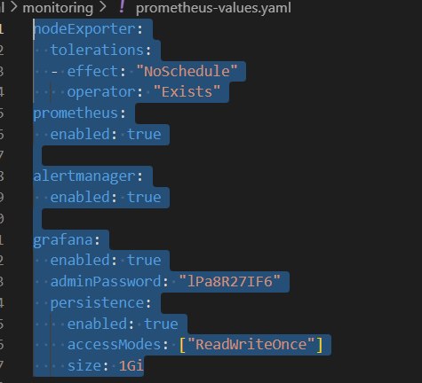
   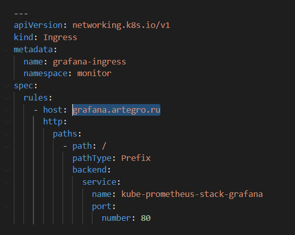    
   
   Так же правим немного ингрес для приложения [testapp](http://gitlab.artegro.ru/netology/testapp/-/blame/main/.gitlab-ci.yml?ref_type=heads#L64) и запускаем.  
   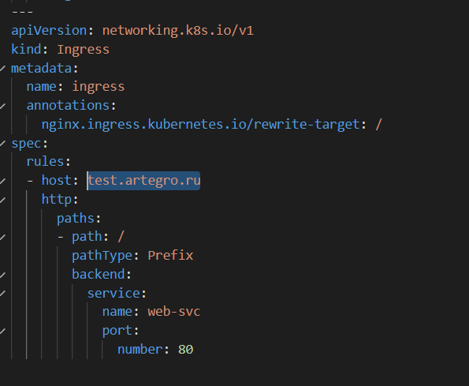  
   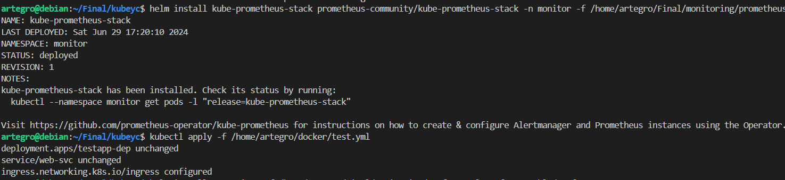   
   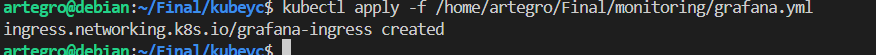   

   Проверяем веб интерфейсы:  
   [Test](http://test.artegro.ru/)  
   [grafana](http://grafana.artegro.ru/d/PwMJtdvnz/1-k8s-for-prometheus-dashboard?orgId=1)  
   login: admin
   password: lPa8R27IF6

   Ну и дашборд
     

*  Git [репозиторий](http://gitlab.artegro.ru/netology/infra) с настройкой кластера k8s. 
*  Мониторинг [monitor](http://gitlab.artegro.ru/netology/monitor) 
*  Сам [пайплайн](http://gitlab.artegro.ru/netology/infra/-/blob/main/.gitlab-ci.yml?ref_type=heads) 

*  Ну и пример работы при коммите в ветку мейн  
   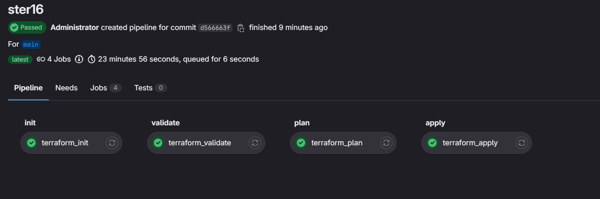  

   Далее по шагам.  
   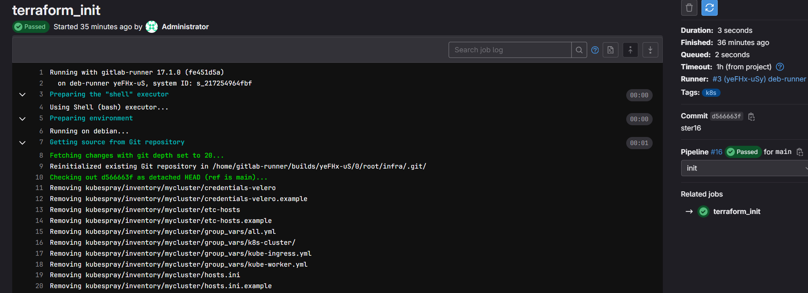  

   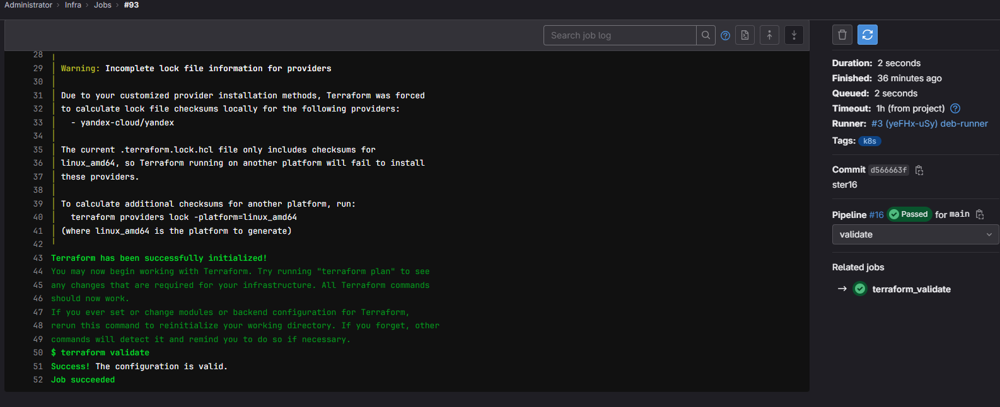  

   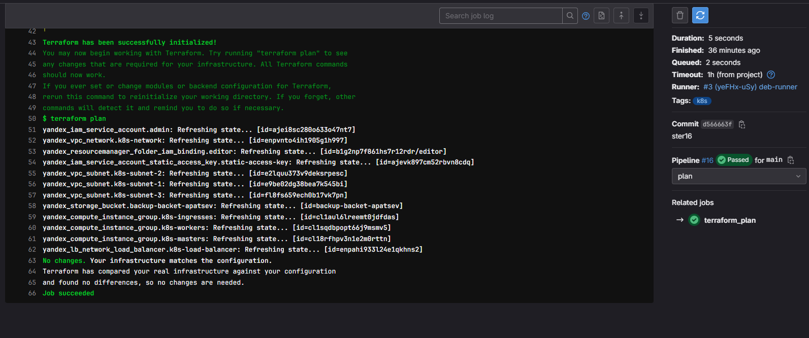  

   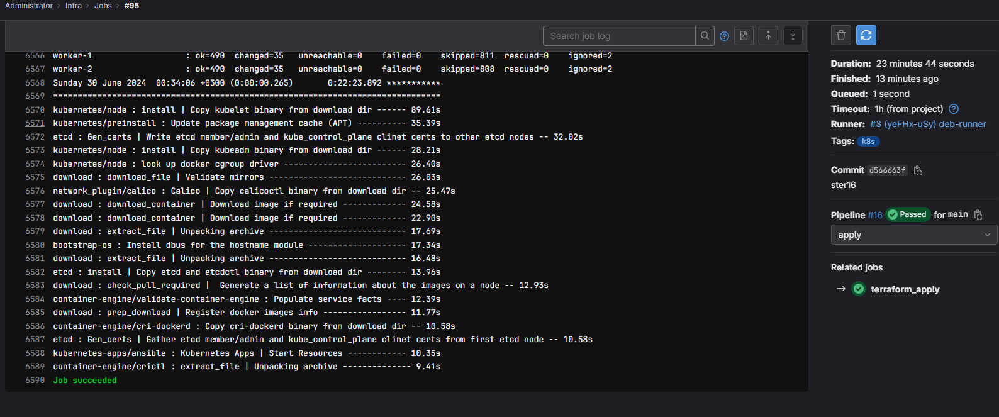

   Изменим состав кластера удалим один ингрес в манифесте [k8s-cluster.tf](http://gitlab.artegro.ru/netology/infra/-/blob/main/terraform/k8s-cluster.tf?ref_type=heads).      
   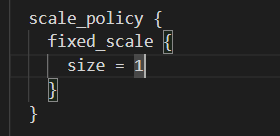   

   И в скрипте манифеста поменяем состав [generate_inventory.sh](http://gitlab.artegro.ru/netology/infra/-/blob/main/terraform/generate_inventory.sh?ref_type=heads).  
     
   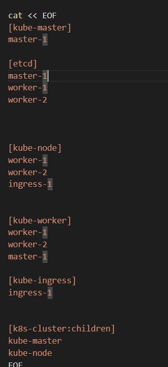  

   Сделаем коммит в ветку майн.
   
   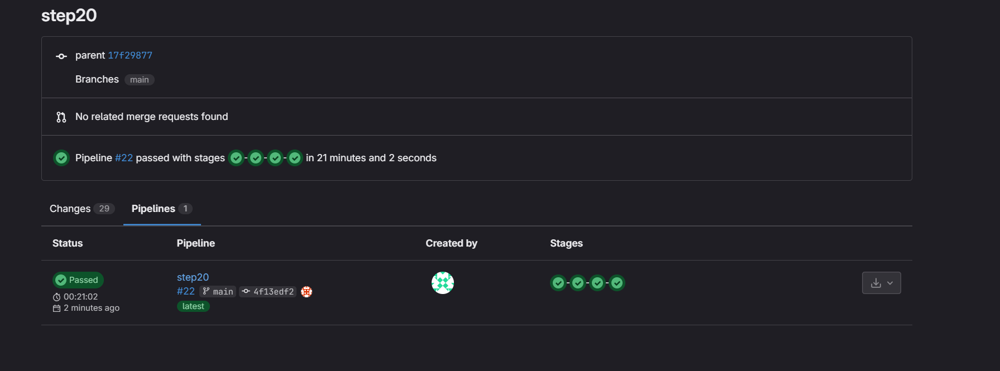

   Проверяем в консоли.  
   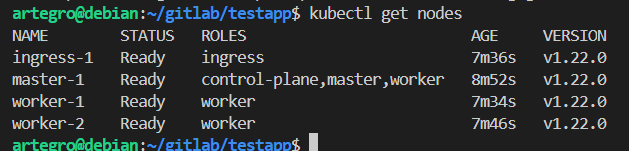  

   Есть нюанс, когда у нас установлен параметр для процессорров `core_fraction = 20`, не всегда с первого раза проходит ансибл кубспрея, но тут достаточно просто перезапустить последнее задание деплоя, но если поставить значение `core_fraction = 100`, то ошибок не возникало.  
   Прилагаю скрин пайплайна с подобной ситуацией 20 процентов.  
   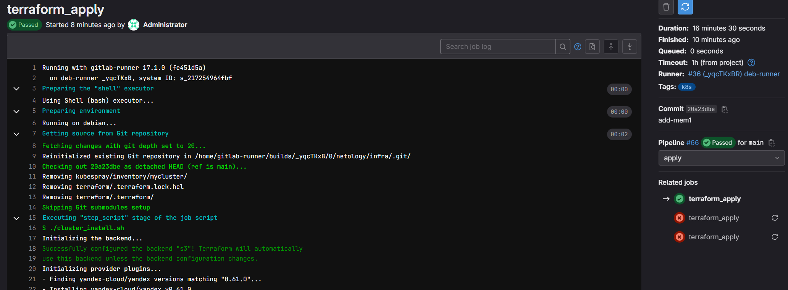  


*  Коммит в ветку Test1 то же проходит, но изменения не применяются.  
   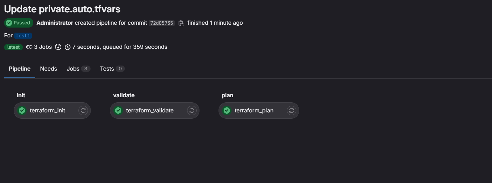

</details>

*  **Работа над ошибками**
   
   *  Git репозиторий с настройкой кластера k8s. Сам пайплайн  
      `14 Вот тут опять не понял. Это что за репозитории? О них ранее упомянуто не было. Почему gitlab-ci.yml лежит в гитхабе? А где ссылка на гитлаб тогда?`  
      Ну и пример работы при коммите в ветку мейн  
      `14 В какой репозиторий?`  
      *  Ответ  
      Тут моя вина, по скольку у меня гитлаб поднят локально, я решил что копии репозитория в github и картринок выполнения pipelines c gitlab будет достаточно.
      Исправлено в ответе, так же прилагаю ссылки на репозитории локального гитлаба (временно прокинул к нему доступ из вне) [Инфраструктура](http://gitlab.artegro.ru/netology/infra) [мониторинг](http://gitlab.artegro.ru/netology/monitor) [приложение](http://gitlab.artegro.ru/netology/testapp)
---
### Установка и настройка CI/CD

Осталось настроить ci/cd систему для автоматической сборки docker ./img/image и деплоя приложения при изменении кода.

Цель:

1. Автоматическая сборка docker образа при коммите в репозиторий с тестовым приложением.
2. Автоматический деплой нового docker образа.

Можно использовать [teamcity](https://www.jetbrains.com/ru-ru/teamcity/), [jenkins](https://www.jenkins.io/), [GitLab CI](https://about.gitlab.com/stages-devops-lifecycle/continuous-integration/) или GitHub Actions.

Ожидаемый результат:

1. Интерфейс ci/cd сервиса доступен по http.
2. При любом коммите в репозиторие с тестовым приложением происходит сборка и отправка в регистр Docker образа.
3. При создании тега (например, v1.0.0) происходит сборка и отправка с соответствующим label в регистри, а также деплой соответствующего Docker образа в кластер Kubernetes.

###   Выполнение

<details> 
  <summary>Выполнение</summary>   

*  Подготовими пайплайн для приложения [.gitlab-ci](http://gitlab.artegro.ru/netology/testapp/-/blob/main/.gitlab-ci.yml?ref_type=heads)

*  Сделаем коммит  и проверим.  
   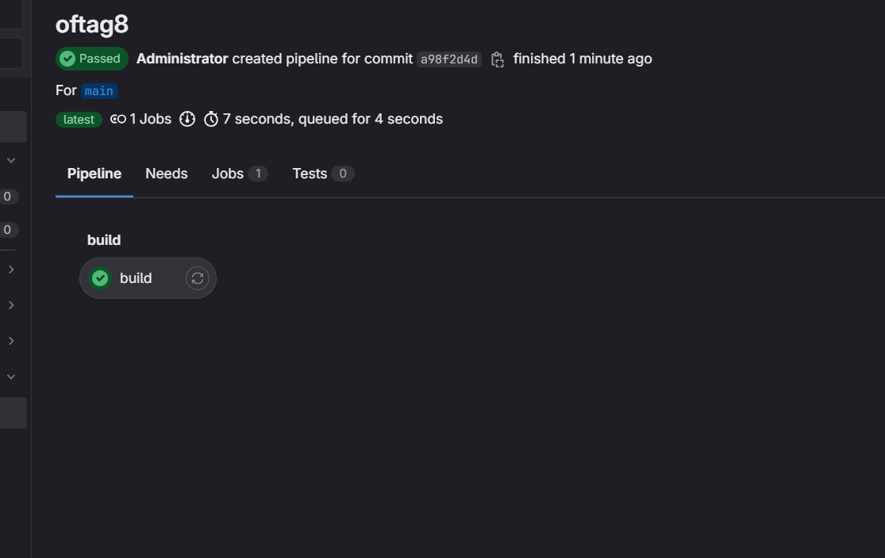  

   Образ собрался и залился в реджести, проверим что он обновился.
   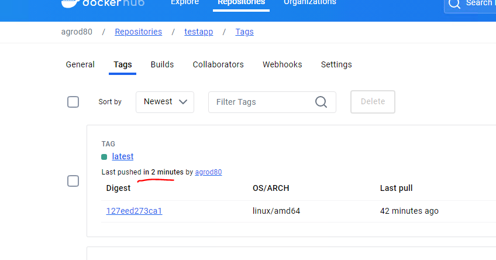  

*  Создадим тег и проверим.
   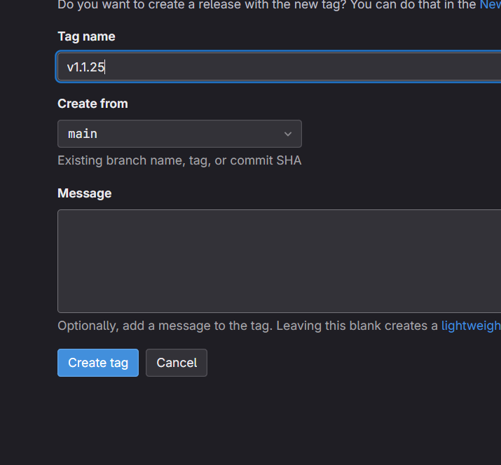  

   Сборка и деплой приложения прошел.  
   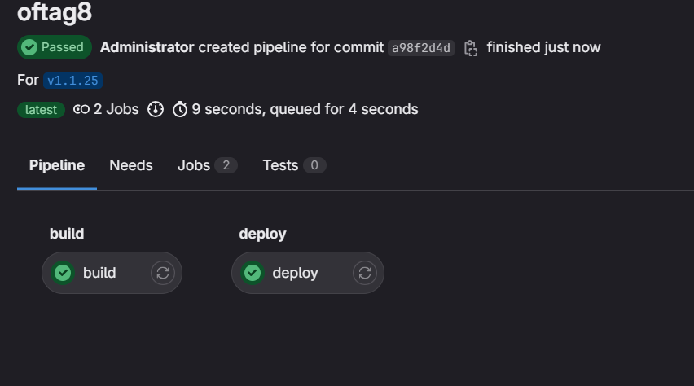  

   Проверим репозиторий.
   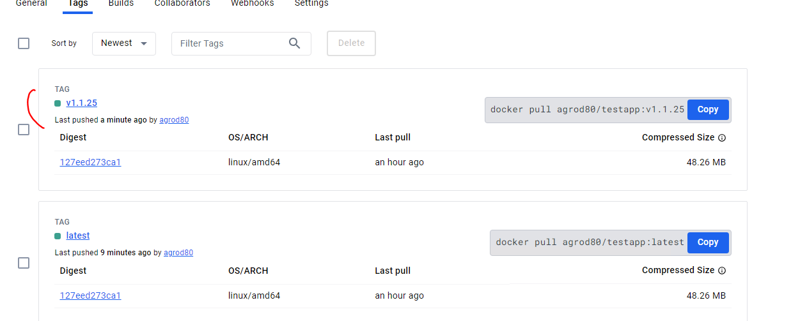

   Проверим что у нас собралось нужной версией приложения.
   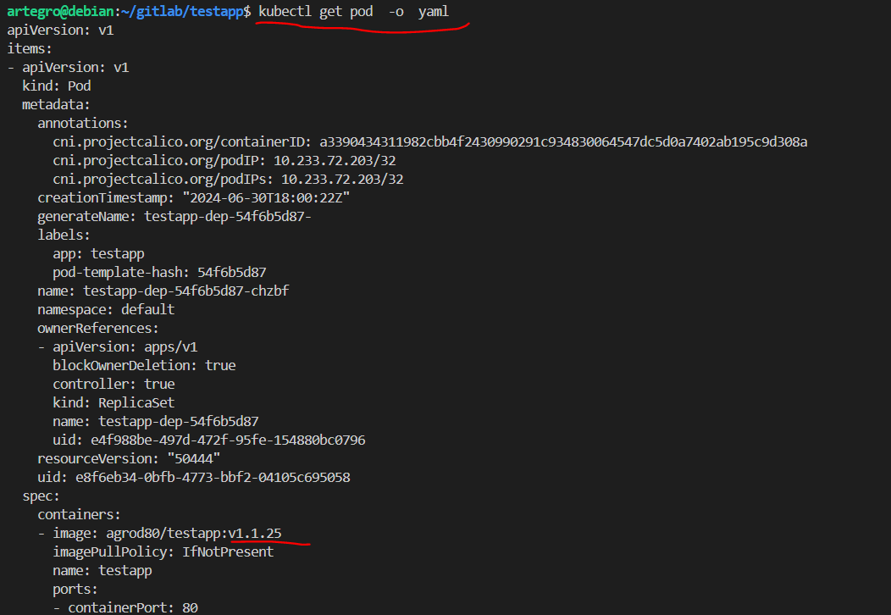

</details> 

Еще раз дублирую ссылки на репозитории и феб интерфесы  
   [Test](http://test.artegro.ru/)  
   [grafana](http://grafana.artegro.ru/d/PwMJtdvnz/1-k8s-for-prometheus-dashboard?orgId=1)   
   Если днс не отрезолдит то пропишите у себя в `hosts`  
   ```
   test.artegro.ru 158.160.173.22
   grafana.artegro.ru 158.160.173.22
   ```
  [Инфраструктура](http://gitlab.artegro.ru/netology/infra)  
  [мониторинг](http://gitlab.artegro.ru/netology/monitor)  
  [приложение](http://gitlab.artegro.ru/netology/testapp)
---
## Что необходимо для сдачи задания?

1. Репозиторий с конфигурационными файлами Terraform и готовность продемонстрировать создание всех ресурсов с нуля.
2. Пример pull request с комментариями созданными atlantis'ом или снимки экрана из Terraform Cloud или вашего CI-CD-terraform pipeline.
3. Репозиторий с конфигурацией ansible, если был выбран способ создания Kubernetes кластера при помощи ansible.
4. Репозиторий с Dockerfile тестового приложения и ссылка на собранный docker ./img/image.
5. Репозиторий с конфигурацией Kubernetes кластера.
6. Ссылка на тестовое приложение и веб интерфейс Grafana с данными доступа.
7. Все репозитории рекомендуется хранить на одном ресурсе (github, gitlab)
