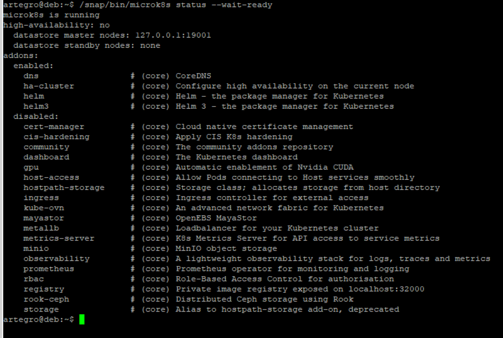
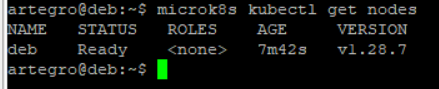
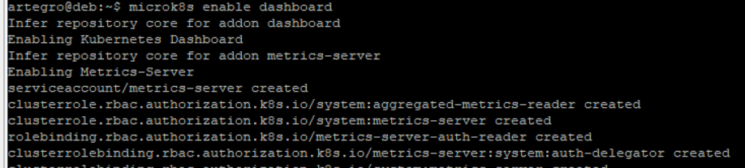
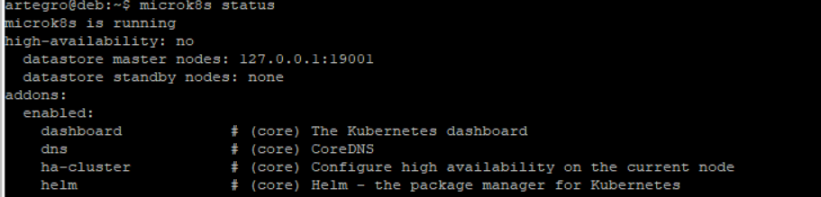
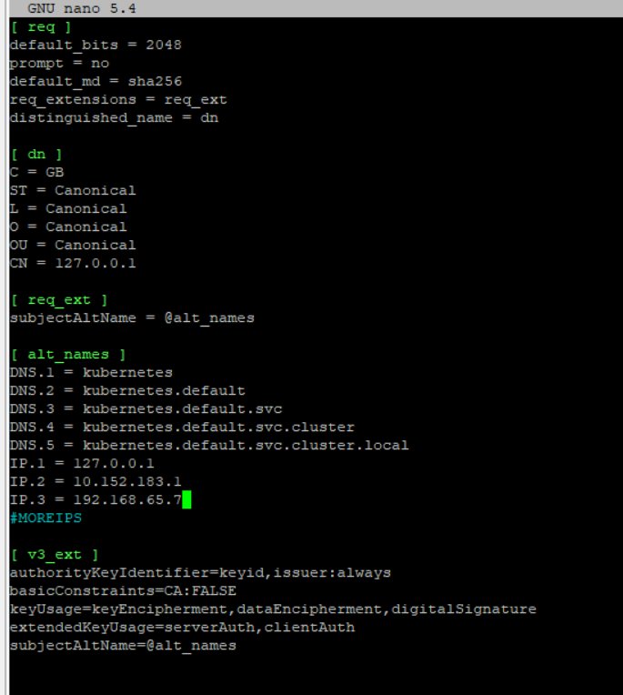
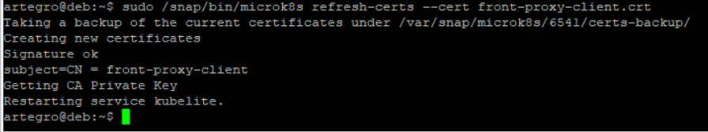
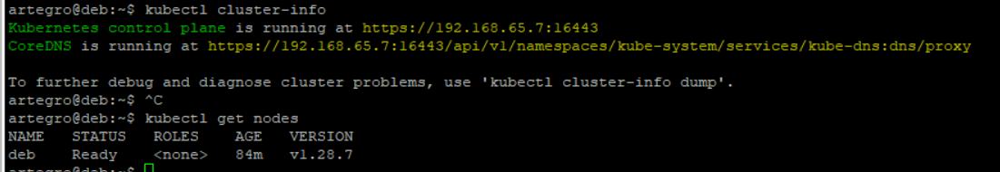
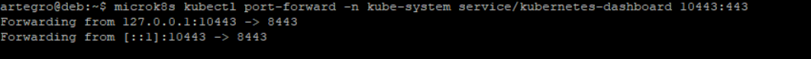
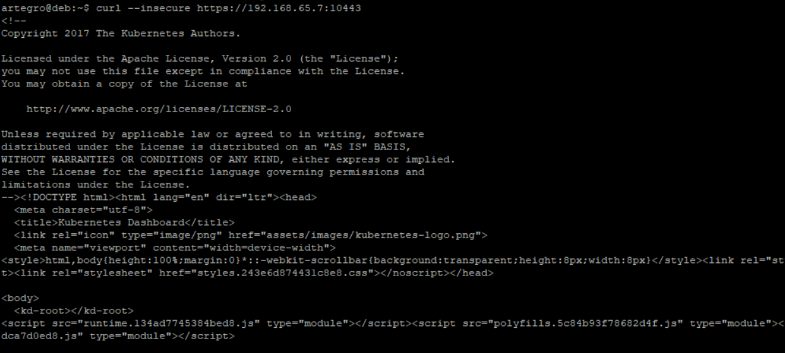

# Домашнее задание к занятию «Kubernetes. Причины появления. Команда kubectl»

### Цель задания

Для экспериментов и валидации ваших решений вам нужно подготовить тестовую среду для работы с Kubernetes. Оптимальное решение — развернуть на рабочей машине или на отдельной виртуальной машине MicroK8S.

------

### Чеклист готовности к домашнему заданию

1. Личный компьютер с ОС Linux или MacOS 

или

2. ВМ c ОС Linux в облаке либо ВМ на локальной машине для установки MicroK8S  

#### Чек лист , готов.
------

### Задание 1. Установка MicroK8S

1. Установить MicroK8S на локальную машину или на удалённую виртуальную машину.

#### Ответ, все по инструкции проблем нет

2. Установить dashboard.

#### Ответ

-   Включаем дашборд

-   Проверяем

3. Сгенерировать сертификат для подключения к внешнему ip-адресу.

#### Ответ

-   прописываем нужный адрес в /var/snap/microk8s/current/certs/csr.conf.template

-   Обновляем и перезапускаем

------

### Задание 2. Установка и настройка локального kubectl
1. Установить на локальную машину kubectl.
2. Настроить локально подключение к кластеру.
3. Подключиться к дашборду с помощью port-forward.

#### Ответ

-   Настроили удаленное подключение 

-   настраиваем порт форвард

-   Проверяем

------

### Правила приёма работы

1. Домашняя работа оформляется в своём Git-репозитории в файле README.md. Выполненное домашнее задание пришлите ссылкой на .md-файл в вашем репозитории.
2. Файл README.md должен содержать скриншоты вывода команд `kubectl get nodes` и скриншот дашборда.

------

### Критерии оценки
Зачёт — выполнены все задания, ответы даны в развернутой форме, приложены соответствующие скриншоты и файлы проекта, в выполненных заданиях нет противоречий и нарушения логики.

На доработку — задание выполнено частично или не выполнено, в логике выполнения заданий есть противоречия, существенные недостатки.
